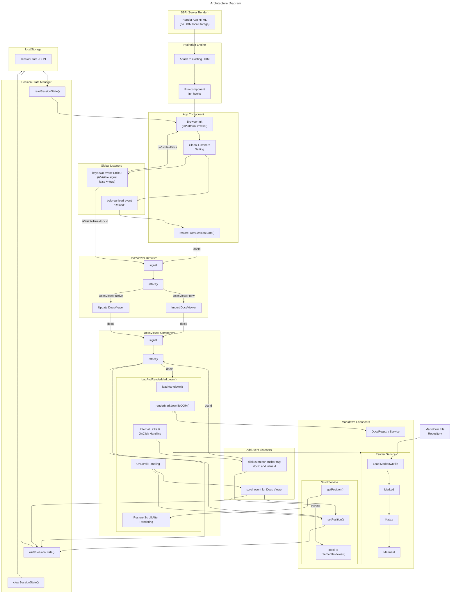

Angular README (ID: angular-readme)
===
---
__This project was generated using [Angular CLI](https://github.com/angular/angular-cli) version 21.0.0.__

> ---

> ### Development server

>> To start a local development server, run:

```bash
          ng serve
```

>> Once the server is running, open your browser and navigate to `http://localhost:4200/`. The application will automatically reload whenever you modify any of the source files.

> ### Code scaffolding

>> Angular CLI includes powerful code scaffolding tools. To generate a new component, run:

```bash
          ng generate component component-name
```

>> For a complete list of available schematics (such as `components`, `directives`, or `pipes`), run:

```bash
          ng generate --help
```

> ### Building

>> To build the project run:

```bash
          ng build
```

>> This will compile your project and store the build artifacts in the `dist/` directory. By default, the production build optimizes your application for performance and speed.

> ### Running unit tests

>> To execute unit tests with the [Karma](https://karma-runner.github.io) test runner, use the following command:

```bash
          ng test
```

> ### Running end-to-end tests

>> For end-to-end (e2e) testing, run:

```bash
          ng e2e
```

>> Angular CLI does not come with an end-to-end testing framework by default. You can choose one that suits your needs.

> ### Additional Resources

>> For more information on using the Angular CLI, including detailed command references, visit the [Angular CLI Overview and Command Reference](https://angular.dev/tools/cli) page.


[1st]:#inlineId:1-folder-structure "§1. Folder Structure(Main Part Only)"
[2nd]:#inlineId:2-key-features "§2. Key Features"
[3rd]:#inlineId:3-architecture-diagram "§3. Architecture Diagram"

---
Application README (ID: application-readme)
=============================
---
__This document is the master reference for the entire documentation rendering system. It explains how Markdown is parsed, enhanced, rendered to html, and synchronized with user navigation.__

---
**[last section][3rd] &emsp; [next section][2nd]**  
<!-- ## 1. Folder Structure(Main Part Only) [next > 2. Key Features](#inlineId:2-key-features) -->
<h2 id="1-folder-structure">§1. Folder Structure(Main Part Only)</h2>

> ----
> The Docs-Vierwer folder contains the documentation viewer and the Markdown rendering pipeline used throughout the project. It includes the viewer component, the renderer service, enhancement logic, lifecycle coordination, and documentation.

```folder
Folder Structure

app/
│  
├── docs-viewer/
│   │
│   ├── docs/ (*1)
│   │   ├── supplements/
│   │   │   ├── doc10-app-0110.md (DocsViewer Key Logic Diagram)
│   │   │   ├── doc10-app-0140.md (Browser Refresh Recovery Diagram)
│   │   │   ├── github-doc-0100.md
│   │   │   └── marked.md
│   │   ├── ANGULARREADME.md
│   │   ├── APPREADME.md
│   │   ├── GITHUBREADME.md
│   │   └── INDEX.md
│   │
│   ├── markdown-enhancers/
│   │   ├── katex.service.ts
│   │   ├── marked.renderer.ts
│   │   ├── mermaid.service.ts
│   │   ├── render.service.ts
│   │   └── scroll.service.ts
│   │
│   ├── meta/ 
│   │   └── docs-meta.ts
│   │
│   ├── registry/
│   │   └── docs-registry.ts
│   │
│   ├── docs-viewer.directive.ts
│   ├── docs-viewer.html
│   ├── docs-viewer.scss
│   ├── docs-viewer.spec.ts
│   ├── docs-viewer.ts
│   └── session-state.manage.ts
│

...

└── app.ts

```

[(*1) See DocsList in th the docs-meta.ts](#docId:docs-meta)

--- 
**[previous section][1st] &emsp; [next section][3rd]**  
<h2 id="2-key-features">§2. Key Features</h2>

> ---
> This is the markdown documentation system, which complies with Katex  and Mermaid renderings. Therefore a user views the most recentlty updated markdown file while editting it, through the browser refersh recovery management.
The system is designed to follow a clear async pipeline that ensures stable layout, correct scroll restoration, and accurate anchor navigation.
    
>1. __App__

>> displays main screen(currently blank, though):

>>- Adds Render2 listeners - beforeunload and keydown
>>- Detects browser refresh  
>>- Restores Session State
>>- Controls visibility of App and DocsViewer templates
>>- Does NOT manage docId or scrollPos

>> [ref-1: app.ts](#docId:app)

>> [ref-2: Browser Refresh Recovery](#docId:doc10-app-0140)


>2. __DocsViewer__

>> displays rendered documentation, manages scroll restoration, anchor navigation. The DocsViewer is created via the [DocsViewerDirective](#docId:viewerdirective):

>>- Owns docId and scrollPos, and writes both into sessionState
>>- navigates one doc to another
>>- loads <a href="https://daringfireball.net/projects/markdown/" target="_blank">Markdown</a>, converts it into html using <a href="https://marked.js.org/" target="_blank">Marked</a>,  renders math typesetting using <a href="https://katex.org/" target="_blank">Katex</a>, renders diagrams & charts using  <a href="https://mermaid.js.org/" target="_blank">Mermaid</a>, via MarkService, reacting to docId signal 
>>- Restores scrollPos after rendering

>> [ref-1: docs-viewer.ts](#docId:docsviewer)

>> [ref-2: DocsViewer Key Logic Diagram](#docId:doc10-app-0110)


>3. __RenderService__

>> loads Markdown, and convert Markdown to html with custom transforms using __Marked__, and enhances html to render mathh typesetting using __Katex__ and to render diagrams and charts using __Mermaid__.Those modules work together through the following async pipeline, which is the backbone of the entire documentation experience.

>>- __Key Public APIs:__

>>>1. loadMarkdown():

>>>> The main entry point for the DocsViewer.
<div class="align-center10">

```typescript
        loadMarkdown(url: string): Observable<string> {
          return this.http.get(url, { responseType: 'text' });
        }
```
</div>

>>>2. renderMarkdown()

>>>> After the loadMarkdown(), converts raw Markdown into HTML synchronously, starts async enhancements, and then ends when all enhancements are complete:
<div class="align-center10">

```typescript
        async renderMarkdownToDOM(
          markdown: string,
          filetype: string | undefined,
          viewer: HTMLElement,
          isDarkMode: boolean
        ): Promise<void> {

          // 1. Markdown -> html
          const html = this.marked?.parse(markdown) as string;
          viewer.innerHTML = html;
          
          // 2. Sanitize text nodes (replace non-breaking spaces)
          sanitizeNodeText(viewer);
          if (filetype !== "ts") {
            // 3. Katex: Render math expressions
            this.katexService.renderMath(viewer);

            // 4. Apply Mermaid theme
            this.mermaidService.applyMermaidTheme(isDarkMode);

            // 5. Wait for DOM + CSS + fonts + transitions
            await this.waitForViewerToSettle(viewer);;

            // 6. Mermaid: Render diagrams and charts
            await this.mermaidService.renderMermaidBlocks(viewer);
          }

          // 7. Wait again for Mermaid’s own layout changes
          await this.waitForViewerToSettle(viewer);

          // force layout flush
          viewer.getBoundingClientRect();
        }
```
</div>

>>- Document(markdown + typrscript) loading (async)
>>- Marked to parse and custom-transform Markdown (sync)
>>- Katex to render math typesetting (async)
>>- Mermaid to render diagrams and (aysnc)
>>- HTML injection (sync)
>>- Layout-sensitive viewer logic (async after completion)
>>- And, this pipeline ensures:

>>>- Stable layout
>>>- Correct scroll restoration
>>>- Accurate anchor navigation

>> [ref-1: render.service.ts](#docId:renderservice)


>4. __Other importnat modules__

>>- [docs-meta.ts](#docId:docs-meta) - meta infomation for reference to markdown files, etc.
>>- [docs-registry.ts](#docsId:docs-registry) - load DocsList in the docs-meta.ts file and provide document title and path
>>- [session-state.manager.ts](#docId:session-state) - helpers to manager SessionState with localStorage

<br/>

> **In summary:**

>1. Rendering is asynchronous
HTML is returned immediately, but enhancements like Mermaid and KaTeX run later.
This means layout is not stable until enhancements complete.

>2. Viewer must wait for enhancementComplete$
Scroll restoration and anchor navigation must run only after enhancements finish.

>3. Renderer owns enhancement timing
The viewer never runs enhancements directly.

>4. Enhancements mutate the DOM
Mermaid injects SVGs, KaTeX replaces nodes, syntax highlighting queues microtasks, and table patching adjusts layout.
    
>5. lifecycle this system follows:

>>1. App toggles(Ctrl+c) visibility → writes DocsViewer via Directive
>>2. DocsViewer updates docId → writes to sessionState
>>3. DocsViewer updates scrollPos → writes to sessionState
>>4. Before unload → App writes refreshed = true
>>5. After refresh → App reads sessionState
>>6. If DocsViewer was active → restore doc and sccroll position
>>7. If App was active → show App screen

---
**[previous section][2nd] &emsp; [first section][1st]**  
<h2 id="3-architecture-diagram">§3. Architecture Diagram</h2>

> ---
<div class="align-center7">
<strong>What This Diagram Shows:</strong>

  1. SSR → Hydration → Browser Init 

  >- SSR renders HTML with no DOM access
  >- Hydration attaches Angular to the existing DOM
  >- App detects browser environment and initializes listeners

  2. App owns refresh detection  [(See Browser Refresh Recovery)](#docId:doc10-app-0140)

  >- Global Listeners Setting

  >>- keydown event - Ctrl+C to toggle App ⇄ DocsViewer
  >>- beforeunload event - sets sessionState.refreshed = true

  >- restoreFromSessionState() decides what to show on reload

  3. DocsViewer owns docId & inlineId + scrollPos [(see DocsViewer Key Logic Diagram)](#docId:doc10-app-0110)

  >- AddEvent Listeners Setting - click event and scroll event
  >- Reactive effect:

  >>- loads raw markdown file, and
  >>- converts markdwon to html using **Marked**, and 
  >>- renders math typesetting using **Katex**, and
  >>- renders diagrams and charts using **Mermaid**
  >- Scroll event update sessionState
  >- click event enables internal navigations among documents, and updates seesionState

  4. ScrollService owns scroll persistence

  >- Saves scrollPos
  >- Restores scroll after markdown render

  5. session-state.manager.ts is the centralized layer

  >- States are:

  >>- component
  >>- docId
  >>- prevDocId
  >>- scrollPos
  >>- refreshed

  6. localStorage is the single source of sessionState

  >- No scattered keys
  >- No hydration surprises
  >- No race conditions

</div>

---


