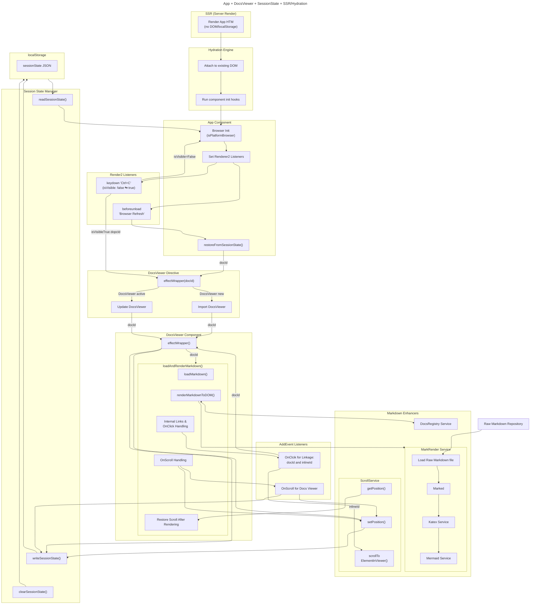
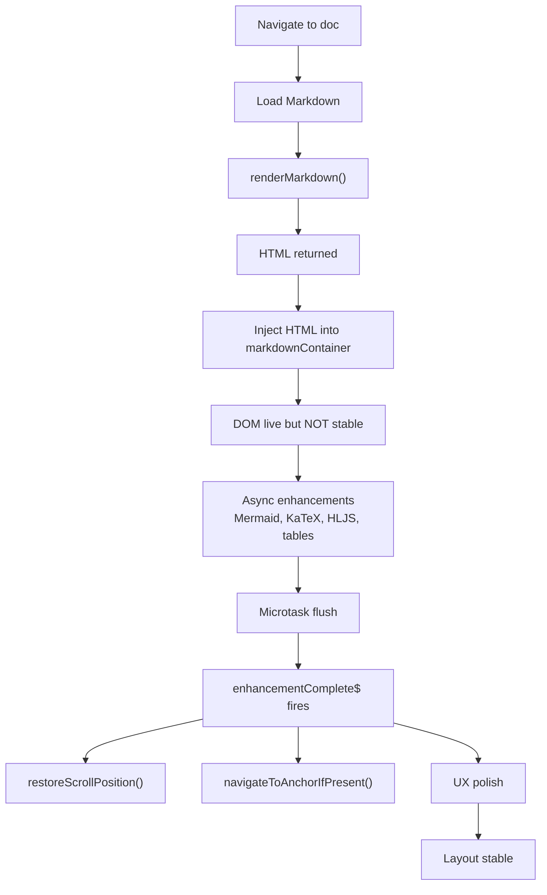
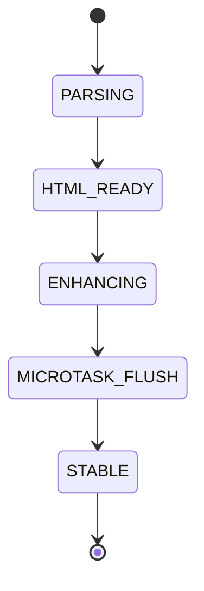

<!-- <div style="page-break-before: always;"></div> -->
# Application README (ID: APPREADME)
This document is the master reference for the entire documentation rendering system. It explains how Markdown is parsed, enhanced, displayed, and synchronized with user navigation. Tt also includes renderings by  Mermaid and KaTeX.
---
## 1. Overview
The documentation system is composed of three tightly coordinated modules:
1. App (app.ts) - displays main screen, which is currently blank
    - Detects refresh
    - Restores state
    - Controls visibility
    - Does NOT manage docId or scrollPos

2. DocsViewer (docs-viewer.ts) — displays rendered documentation, manages scroll restoration, anchor navigation, and UX polish. The DocsViewer is created via the DocsViewerDirective (docs-viewer.directive.ts)
    - Owns docId
    - Owns scrollPos
    - Writes both into sessionState
    - Restores scroll after rendering

3. MarkrenderService (mark-render.service.ts) — parses Markdown, applies transforms, runs async enhancements, and signals when layout is stable. The modeule uses KatexService(katex.service) and MermaidService(mermaid.service.ts) to render Latex and Mermaid graphs.

These modules work together through the following async pipeline:
  - Markdown parse (sync)
  - Katex and Mermaid renderings
  - HTML injection (sync)
  - Async enhancements (async)
  - Layout-sensitive viewer logic (async after completion)

This pipeline ensures:
  - Stable layout
  - Correct scroll restoration
  - Accurate anchor navigation
  - Smooth UX

3. Other importnat modules
  - docs-meta.ts - meta infomation for reference to markdown files, etc.
  - docs-viewer.utls.ts 
    - Owns persistence
    - SSR‑safe
    - Hydration‑safe
    - Centralized
    - Predictable
    - SessionState helpers

Here’s the lifecycle this system now follows:

1. App toggles visibility → writes component
2. DocsViewer updates docId → writes to sessionState
3. DocsViewer updates scrollPos → writes to sessionState
4. Before unload → App writes refreshed = true
5. After refresh → App reads sessionState
6. If DocsViewer was active → restore doc + scroll
7. If App was active → show App screen
8. DocsViewer loads markdown → restores scroll
9. Everything feels seamless

## 2. System Architecture

### architecture diagram that includes:
  - App
  - DocsViewer
  - ScrollService
  - docs-viewer.utils
  - sessionState
  - SSR + hydration lifecycle



<div class="align-center">
<strong>What This Diagram Shows:</strong>

  1. SSR → Hydration → Browser Init 
      - SSR renders HTML with no DOM access
      - Hydration attaches Angular to the existing DOM
      - App detects browser environment and initializes listeners

  2. App owns refresh detection 
      - Render2 Listeners Setting - 'click', 'beforeunload'
        - click navigates to two internal links of docId and inlineId 
        - beforeunload sets refreshed = true
      - restoreFromSessionState() decides what to show on reload

  3. DocsViewer owns docId & inlineId + scrollPos 
      - AddEvent Listeners Setting - 'scroll'
      - Reactive effect loads markdown
        - render markdwon to html through 'Marked', 'Katex', and 'Mermaid
      - Scroll events update sessionState
      - Internal navigation updates seesionState

  4. ScrollService owns scroll persistence
      - Saves scrollPos
      - Restores scroll after markdown render

  5. session-state.manager.ts is the centralized layer
      - States are:
        - component
        - docId
        - scrollPos
        - refreshed

  6. localStorage is the single source of truth
      - No scattered keys
      - No hydration surprises
      - No race conditions

</div>


### 🔄 [Render API Refernce](#docId:app0040)



### 🧠 [Renderer State Machine](#docId:state0010)

### 🛠️ [API References](#docId:guides0030)
docs-viewer.component
Public Methods
loadDocument(path: string)

restoreScrollPosition()

navigateToAnchorIfPresent()

Internal Helpers
saveScrollPosition()

scrollTo(y: number)

scrollToAnchor(id: string)

Responsibilities
Inject HTML

Subscribe to enhancementComplete$

Run layout-sensitive logic

mark-render.service
Public Method
renderMarkdown(markdown: string): RenderResult

RenderResult
```ts
interface RenderResult {
  html: string;
  enhancementComplete$: Observable<void>;
}
```
Internal Enhancers
runMermaid()

runKatex()

runSyntaxHighlighting()

patchTablesForTheme()

Enhancement Aggregation
```ts
Promise.all(tasks).then(() => {
  queueMicrotask(() => this.enhancementComplete$.next());
});
```
### 📘 [ADR Summary](#docId:adr0010)
ADR: Async Rendering Pipeline
Defines:

The four-phase pipeline

Renderer/viewer responsibilities

Enhancement completion contract

Trade-offs and consequences

This ADR is the architectural backbone of the system.

### 🧩 Contributor Guides
[Contributor Guide (Narrative)](#docId:guides0010) 
Explains:

Why rendering is async

Why scroll logic must wait

How enhancements mutate the DOM

How to safely extend the system

Lifecycle Checklist
Covers:

Do/Don’t rules

Debugging timing issues

Adding new enhancements

Avoiding common pitfalls

Viewer Lifecycle Diagram
Shows:

When viewer acts

When viewer waits

How enhancements affect layout


### 📁 [Conponent Dependency Graph](#docId:app0010)

### 📁 [Folder Structure (Annotated)](#docId:app0020)

### 📁 [Architecture Diagram](#docId:app0030)

### 📁 [Refresh Recovery Lifecycle Diagram](#docId:app0060)

### 🎯 Goals of the Documentation System
Make the architecture explicit

Make the async pipeline predictable

Make onboarding friendly

Make enhancements safe to extend

Make lifecycle bugs rare and easy to diagnose

This documentation is designed to be a living system that grows with the project.

### 🏁 Final Notes
This comprehensive documentation package now includes:

Full folder README

Renderer API reference

Viewer API reference

Contributor guide

Lifecycle checklist

Renderer state machine

Viewer lifecycle diagram

ADR for the async pipeline

Architecture diagrams

Enhancement pipeline documentation

This is the complete, unified documentation system you envisioned — explicit, visual, modular, and contributor‑friendly.

### [What Goes Where” Cheat Sheet](#docId:app0900)

