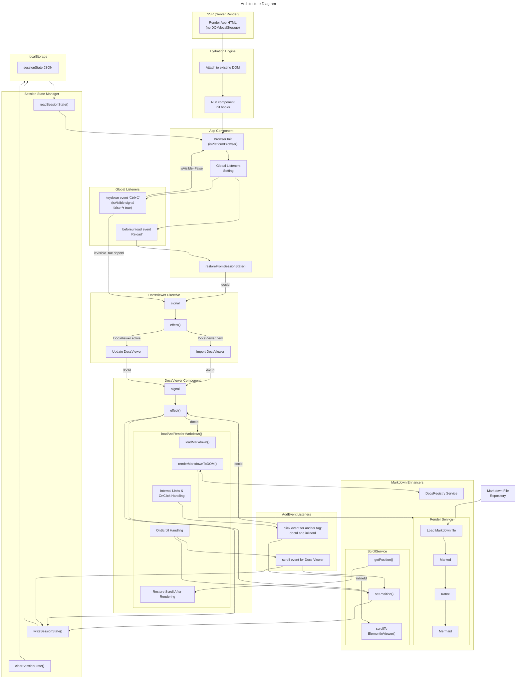

[previous-link]:#docId:doc10-app-0100
[next-link]:#docId:doc10-app-0300
[<- previous: Overview][previous-link] &ensp; &ensp; &ensp; [next: Component Dependency ->][next-link]

---
Architecture Diagram (ID:doc10-app-0200)
========================================
---

<strong>What This Diagram Shows:</strong>

  1. SSR → Hydration → Browser Init 

  >- SSR renders HTML with no DOM access
  >- Hydration attaches Angular to the existing DOM
  >- App detects browser environment and initializes listeners

  2. App owns refresh detection  [(See Browser Refresh Recovery)](#docId:doc10-app-0140)

  >- Global Listeners Setting

  >>- keydown event - Ctrl+C to toggle App ⇄ DocsViewer
  >>- beforeunload event - sets sessionState.refreshed = true

  >- restoreFromSessionState() decides what to show on reload

  3. DocsViewer owns docId & inlineId + scrollPos [(see DocsViewer Key Logic Diagram)](#docId:doc10-app-0110)

  >- AddEvent Listeners Setting - click event and scroll event
  >- Reactive effect:

  >>- loads raw markdown file, and
  >>- converts markdwon to html using **Marked**, and 
  >>- renders math typesetting using **Katex**, and
  >>- renders diagrams and charts using **Mermaid**
  >- Scroll event update sessionState
  >- click event enables internal navigations among documents, and updates seesionState

  4. ScrollService owns scroll persistence

  >- Saves scrollPos
  >- Restores scroll after markdown render

  5. session-state.manager.ts is the centralized layer

  >- States are:

  >>- component
  >>- docId
  >>- prevDocId
  >>- scrollPos
  >>- refreshed

  6. localStorage is the single source of sessionState

  >- No scattered keys
  >- No hydration surprises
  >- No race conditions

---

---
[<- previous: Overview][previous-link] &ensp; &ensp; &ensp; [next: ComponentDependency ->][next-link]
