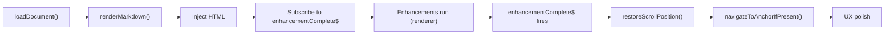

[previous-link]:#docId:doc10-app-0210
[next-link]:#docId:doc10-app-0230
[<- previous: DocsViewer Lifecycle Diagram][previous-link] &ensp; &ensp; &ensp; [next: MarkService API Reference ->][next-link]

---
# DocsViewer API Reference (ID:doc10-app-0220)

docs-viewer.component.ts
This document explains the public and internal APIs of the docs viewer. It clarifies how the viewer interacts with the renderer, manages scroll restoration, handles anchor navigation, and coordinates layout-sensitive logic.

1. Public Interface
loadDocument(path: string): void
Loads a Markdown document from the given path and triggers the full rendering pipeline.

Responsibilities
Fetch Markdown

Call renderMarkdown()

Inject HTML

Subscribe to enhancement completion

Restore scroll and anchors

Typical flow
```ts
loadDocument(path: string) {
  const markdown = this.fileService.read(path);
  const result = this.markRenderService.renderMarkdown(markdown);

  this.markdownContainer.nativeElement.innerHTML = result.html;

  result.enhancementComplete$.pipe(take(1)).subscribe(() => {
    this.restoreScrollPosition();
    this.navigateToAnchorIfPresent();
  });
}
```
2. Layout-Sensitive Methods
restoreScrollPosition(): void
Restores the viewer’s scroll position after enhancements complete.

Notes
Must run after enhancementComplete$

Uses stored scroll offsets

Sensitive to DOM height changes

navigateToAnchorIfPresent(): void
Navigates to an in-page anchor (e.g., #section-title) after layout stabilizes.

Notes
Must run after enhancements

Uses document.getElementById()

Scrolls smoothly or instantly depending on UX settings

3. HTML Injection
```ts
markdownContainer: ElementRef<HTMLElement>
```
The DOM container where rendered HTML is injected.

Injection pattern
```ts
this.markdownContainer.nativeElement.innerHTML = result.html;
```
Important
HTML injection is not a signal that layout is stable

Enhancements will mutate this DOM

4. Enhancement Synchronization
result.enhancementComplete$: Observable<void>
Provided by the renderer. The viewer must subscribe to this before running any layout-sensitive logic.

Required usage
```ts
result.enhancementComplete$
  .pipe(take(1))
  .subscribe(() => {
    this.restoreScrollPosition();
    this.navigateToAnchorIfPresent();
  });
```
Why it matters
Mermaid changes layout

KaTeX changes line height

Syntax highlighting queues microtasks

Table patching adjusts widths

5. Internal Helpers
saveScrollPosition(): void
Stores the current scroll position before navigation.

scrollTo(y: number): void
Scrolls the container to a specific vertical offset.

extractAnchorFromUrl(): string | null
Parses the current URL for an anchor fragment.

scrollToAnchor(id: string): void
Scrolls to a specific element by ID.

6. Viewer Responsibilities Summary
The viewer does
Load Markdown

Inject HTML

Subscribe to enhancement completion

Restore scroll

Navigate to anchors

Apply UX polish

The viewer does NOT
Run enhancements

Assume HTML injection means layout is stable

Emit enhancement completion signals

Modify DOM during enhancement phase

7. Contributor Notes
If you modify viewer logic:
Keep scroll and anchor logic after enhancementComplete$

Avoid running layout-sensitive code during HTML injection

Never call enhancement methods directly

If you add new viewer features:
Ensure they run in the correct lifecycle phase

Use take(1) to avoid memory leaks

Test with Mermaid-heavy and KaTeX-heavy documents

8. Visual Summary


---
[<- previous: DocsViewer Lifecycle Diagram][previous-link] &ensp; &ensp; &ensp; [next: MarkService API Reference ->][next-link]
