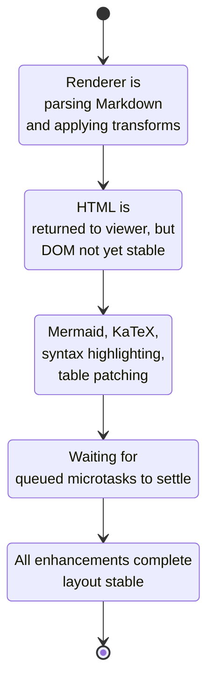

[previous-link]:#docId:doc10-app-0240
[next-link]:#docId:doc10-app-0200
[<- previous: Browser Refersh Recovert Diagram][previous-link] &ensp; &ensp; &ensp; [next: Architecture Diagram ->][next-link]

---
# Renderer State Machine (MarkSevice)

The renderer follows a predictable set of states during the Markdown → HTML → enhanced DOM pipeline. This state machine makes the async lifecycle explicit and helps contributors understand when layout is stable and when it is not.

---



---

## State Definitions
PARSING
Triggered by:

```ts
renderMarkdown(markdown)
```
Actions:

Markdown → HTML conversion

Architecture label transforms

Table class injection

Link rewriting

Characteristics:

Fully synchronous

No DOM access

HTML_READY

Renderer returns:

```ts
{ html, enhancementComplete$ }
```
Viewer injects HTML into:

```ts
markdownContainer.innerHTML
```
Characteristics:

DOM is live

Layout is not stable

Enhancements have not run

ENHANCING
Enhancers run in parallel:

```ts
runMermaid()

runKatex()

runSyntaxHighlighting()

patchTablesForTheme()
```

Characteristics:

DOM is mutating

Layout height changes

Scroll restoration must not run

MICROTASK_FLUSH
After all enhancers finish, the renderer queues:

```ts
queueMicrotask(() => enhancementComplete$.next());
```
Purpose:

Ensures syntax highlighter microtasks finish

Ensures Mermaid layout stabilizes

Guarantees final DOM height

STABLE
Renderer emits:

```ts
enhancementComplete$.next()
```
Viewer may now safely run:

```ts
restoreScrollPosition()

navigateToAnchorIfPresent()
```

UX transitions

Characteristics:

Layout is final

No further DOM mutations expected

Why this state machine matters
It gives contributors a mental model of the pipeline.

It prevents lifecycle regressions.

It clarifies where new enhancements must be inserted.

It explains why scroll restoration must wait for STABLE.

It aligns with your documentation philosophy: explicit, visual, contributor‑friendly.

---
[<- previous: Browser Refersh Recovert Diagram][previous-link] &ensp; &ensp; &ensp; [next: Architecture Diagram ->][next-link]
