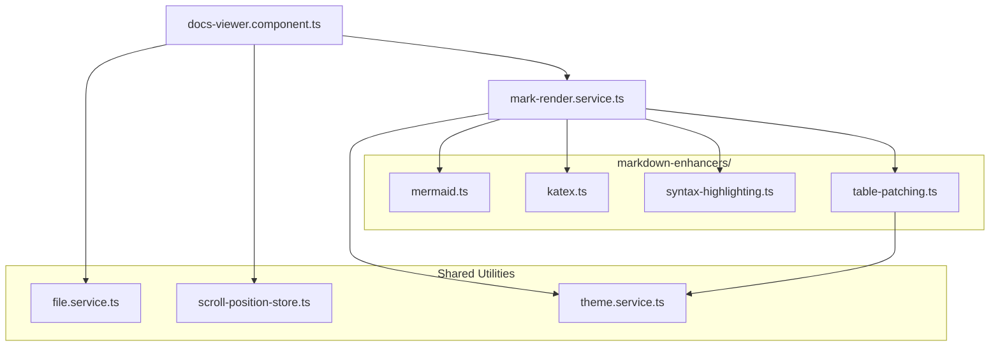

[previous-link]:#docId:doc10-app-0200
[next-link]:#docId:doc10-app-0400
[<- previous: Architecture Diagram][previous-link] &ensp; &ensp; &ensp; [next: Module Responsibility Map ->][next-link]

---
Component Dependency (ID:doc10-app-0300)
========================================
---
Diagram
-------

What This Diagram Communicates:
------------------------------
1. DocsViewer is the top-level orchestrator and depends on:

>- the renderer
>- file loading
>- scroll state

2. MarkService is the enhancement coordinator and depends on:

>- Mermaid
>- KaTeX
>- Syntax highlighting
>- Table patching
>- Theme utilities

3. Enhancers are leaf components

>- They do not depend on the viewer.
>- They do not depend on each other.
>- They only depend on shared utilities (e.g., theme service).

4. The dependency direction is clean

>- Viewer → Renderer
>- Renderer → Enhancers
>- Enhancers → Shared utilities

This is exactly the kind of architectural clarity that prevents circular dependencies and onboarding confusion.

---
[<- previous: Architecture Diagram][previous-link] &ensp; &ensp; &ensp; [next: Module Responsibility Map ->][next-link]
