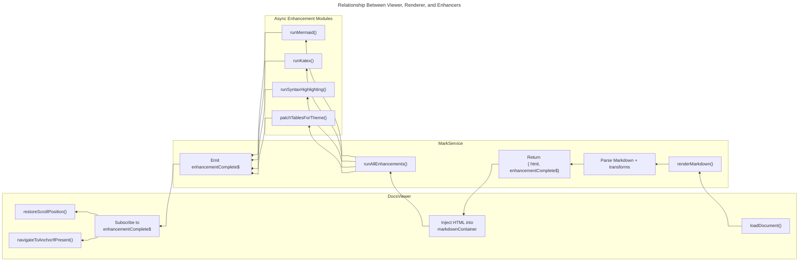

[previous-link]:#docId:doc10-app-0300
[next-link]:#docId:doc10-app-0100
[<- previous: Component Dependency][previous-link] &ensp; &ensp; &ensp; [next: back to Overview ->][next-link]

---
Module Responsibility Map
=========================
---

What This Diagram Communicates
---------------------------------
- The viewer initiates rendering and handles layout‑sensitive logic.
- The renderer parses Markdown, coordinates enhancements, and signals when layout is stable.
- The enhancers mutate the DOM asynchronously and must all complete before scroll restoration or anchor navigation can run.
- The enhancementComplete$ observable is the synchronization point between renderer and viewer.

This map defines the single, clear responsibility of each module in the documentation rendering system.
It prevents role confusion, lifecycle bugs, and accidental cross‑layer coupling.

Top-Level Modules
-----------------

1. docs-viewer.component.ts

>Responsibility:  
>>Displays rendered documentation and performs all layout-sensitive logic after enhancements complete.

>Owns:
>- Loading Markdown
>- Injecting HTML
>- Scroll restoration
>- Anchor 
>- UX polish

>Must NOT:
>- Run enhancements
>- Assume HTML injection means layout is stable
>- Emit enhancement completion signals

2. mark.service.ts

>Responsibility:  
>>Transforms Markdown into HTML and coordinates all async enhancements, signaling when the DOM is stable.

>Owns:
>- Markdown parsing
>- Custom transforms
>- Enhancement pipeline
>- enhancementComplete$ observable

>Must NOT:
>- Perform scroll logic
>- Handle anchor navigation
>- Depend on viewer internals

Enhancement Modules (markdown-enhancers/)
-----------------------------------------
1. mermaid.ts

>Responsibility:  
>>Render Mermaid diagrams and inject SVGs into the DOM.

>Must NOT:
>- Emit completion signals
>- Modify scroll or anchors

1. katex.ts

>Responsibility:  
>>Render inline and block math expressions using KaTeX.

>Must NOT:
>- Coordinate enhancement timing
>- Interact with viewer logic

syntax-highlighting.ts
Responsibility:  
Apply syntax highlighting to code blocks.

Must NOT:

Trigger scroll restoration

Modify non-code elements

table-patching.ts
Responsibility:  
Apply theme-aware table classes and fix layout issues.

Must NOT:

Perform rendering

Handle navigation

Shared Utilities
----------------

file.service.ts
Responsibility:  
Load raw Markdown files from disk or assets.

Must NOT:

Parse Markdown

Modify DOM

scroll-position-store.ts
Responsibility:  
Store and retrieve scroll positions across navigations.

Must NOT:

Trigger scroll restoration

Interact with enhancements

theme.service.ts
Responsibility:  
Provide theme information (light/dark) to enhancers and renderer.

Must NOT:

Modify layout

Handle rendering

Cross‑Module Rules
------------------------

Viewer → Renderer
Viewer calls renderMarkdown() and waits for enhancementComplete$.

Renderer → Enhancers
Renderer coordinates all async enhancement tasks.

Enhancers → Shared Utilities
Enhancers may use theme or utility services but never call viewer or renderer methods.

No upward dependencies
Enhancers never depend on renderer.
Renderer never depends on viewer.

Why This Map Matters
--------------------

Prevents accidental circular dependencies

Makes responsibilities explicit for onboarding

Ensures enhancements remain modular

Keeps viewer logic clean and lifecycle-safe

Supports long-term maintainability

TasK Module Table
-----------------

| Task                   | Goes Where                               |
|------------------------|-------------------------------------------|
| Parse Markdown         | mark-render.service.ts                    |
| Run Mermaid            | markdown-enhancers/mermaid.ts             |
| Run KaTeX              | markdown-enhancers/katex.ts               |
| Highlight code         | markdown-enhancers/syntax-highlighting.ts |
| Patch tables           | markdown-enhancers/table-patching.ts      |
| Aggregate enhancements | mark-render.service.ts                    |
| Inject HTML            | docs-viewer.component.ts                  |
| Restore scroll         | docs-viewer.component.ts                  |
| Anchor navigation      | docs-viewer.component.ts                  |
| Load files             | file.service.ts                           |
| Theme logic            | theme.service.ts                          |
| Documentation          | guides/, state/, ADRs/                    |

 

---
[<- previous: Component Dependency][previous-link] &ensp; &ensp; &ensp; [next: back to Overview ->][next-link]
