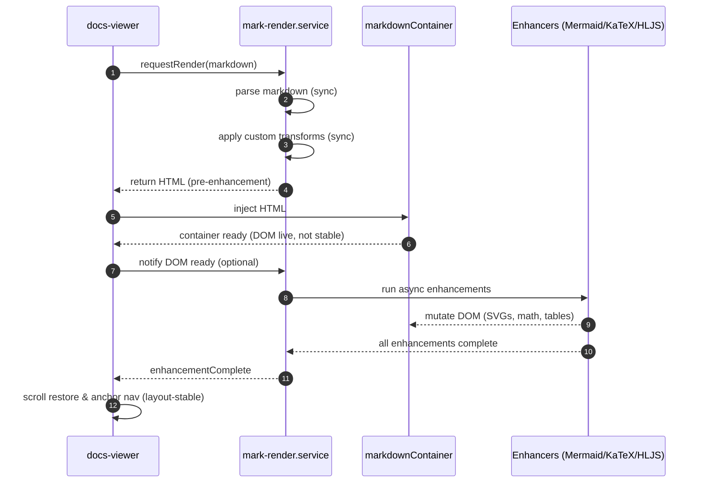

Status
Status: Proposed

Date: 2025-12-31

Owner: Masaaki

Scope: docs-viewer, mark-render.service, Markdown rendering pipeline

Context
The documentation viewer uses mark-render.service to transform Markdown into HTML and then applies several async “enhancements” (Mermaid, KaTeX, syntax highlighting, theme-aware tables). These enhancements mutate the DOM after HTML injection and can significantly change layout and scroll height.

At the same time, the docs-viewer is responsible for:

Scroll restoration: Restoring scroll position when navigating between docs.

Anchor navigation: Jumping to in-page anchors like #section.

UX polish: Avoiding layout jumps and “snapping” during first load.

Previously, the boundary between the viewer and renderer was implicit:

The viewer often assumed that HTML injection implied layout stability.

Enhancements were treated as implementation details, not as an explicit async pipeline.

Scroll restoration and anchor jumps sometimes ran before Mermaid/KaTeX/SASS-driven layout changes, causing visible flicker and incorrect offsets.

We need an explicit, documented pipeline and contract between docs-viewer and mark-render.service to:

Stabilize layout-sensitive behavior (scroll, anchors).

Make async behavior understandable to contributors.

Prevent lifecycle regressions when changing renderer internals.

Decision
We define an explicit async rendering pipeline with clear responsibilities and signals:

Renderer owns enhancement timing.  
mark-render.service is the single source of truth for when Markdown enhancements (Mermaid, KaTeX, syntax highlighting, table patches) are finished.

Viewer owns layout-sensitive logic.  
docs-viewer controls scroll restoration, anchor navigation, and visual polish, but only after the renderer signals that enhancements are complete.

Pipeline phases are explicit and documented.  
The pipeline is defined as four phases with a clear contract:

Phase 1 – Markdown parse (renderer, sync):

Input: Raw Markdown.

Output: HTML with custom transforms applied (architecture labels, table classes, link rewrites, etc.).

Characteristics: Synchronous; no DOM access.

Phase 2 – HTML injection (viewer, sync):

Input: HTML from renderer.

Output: HTML inserted into markdownContainer in the DOM.

Characteristics: Synchronous; DOM becomes “live” but not yet stable.

Phase 3 – Async enhancements (renderer-controlled, async):

Enhancers: Mermaid, KaTeX, syntax highlighting, theme-aware table patching, etc.

Behavior: Enhancers mutate the DOM and can significantly change layout.

Contract: Renderer exposes a unified completion signal (enhancementComplete / observable / promise).

Phase 4 – Layout-sensitive post-processing (viewer, async after signal):

Actions: Scroll restoration, anchor jumps, final UX adjustments.

Constraint: Must run only after renderer signals enhancements are complete and microtasks have settled.

Renderer exposes a unified enhancement completion signal.  
The renderer aggregates all async work into a single “enhancements complete” event (e.g., an observable like enhancementComplete$ or a promise), which is the only event the viewer trusts for layout stability.

Viewer defers scroll and anchor logic to renderer completion.  
The viewer:

Injects HTML immediately after parse.

Waits for enhancementComplete before:

Restoring scroll position.

Navigating to anchors.

Applying layout-sensitive transitions or effects.

---

**Sequence diagram**

---

**Flowchart (pipeline overview)**
```mermaid
flowchart TD

    A[Start: Markdown requested] --> B[Renderer: Parse Markdown (sync)]
    B --> C[Renderer: Apply custom transforms (sync)]
    C --> D[Viewer: Inject HTML into markdownContainer]
    D --> E[DOM: Container becomes live]

    E --> F[Renderer: Run async enhancements<br/>(Mermaid, KaTeX, HLJS, tables)]
    F --> G[Renderer: Wait for all enhancements<br/>and microtasks to complete]
    G --> H[Renderer: Emit enhancementComplete signal]

    H --> I[Viewer: Restore scroll position]
    I --> J[Viewer: Navigate to anchor (if any)]
    J --> K[Viewer: Final UX polish (optional)]
    K --> L[End: Layout-stable view]
```
---

Consequences
Positive
Reliable scroll restoration:

Scroll logic: Runs only when layout is stable, avoiding “jumping” as Mermaid/KaTeX finish.

Experience: Users and contributors see a smooth, predictable scroll behavior.

Correct anchor navigation:

Anchor jumps: Operate on the final DOM structure, so target headings are correctly aligned in view.

Clear separation of responsibilities:

Renderer: Focuses on parsing and enhancement timing.

Viewer: Focuses on presentation and navigation.

Onboarding: New contributors can see “who owns what” at a glance.

Documented lifecycle:

The pipeline offers a concrete basis for:

Mermaid sequence diagrams.

Flowcharts.

Onboarding guides and checklists.

Negative / trade-offs
Added complexity in renderer:

The renderer needs to coordinate multiple async tasks (Mermaid, KaTeX, etc.) and expose a unified signal.

Potential for coupling if not carefully designed:

If the viewer depends on too many specific renderer events, the contract can become brittle.

The ADR should emphasize abstract signals (e.g., “enhancements complete”) rather than specific library details.

Slight delay before final scroll/anchor logic:

Users may see content before scroll restoration completes, especially on slow enhancements.

This is an intentional trade-off for correctness and stability.

Implementation notes
Renderer API shape (conceptual):

Method:

render(markdown: string): RenderResult

Result structure (example):

html: Parsed HTML.

enhancementComplete$: Observable or promise that resolves when:

Mermaid has rendered all diagrams.

KaTeX has rendered all math.

Syntax highlighting is applied.

Table patches are applied.

Pending microtasks are flushed (if necessary).

Viewer lifecycle checklist:

On navigation:

Step 1: Call render(markdown) on the renderer.

Step 2: Inject html into markdownContainer.

Step 3: Subscribe to enhancementComplete$.

Step 4: When complete:

Restore scroll position.

Navigate to anchor (if present).

Apply any visual transitions.

Microtask flush (optional but recommended):

After enhancements complete, the renderer may queue a microtask:

queueMicrotask(() => enhancementComplete.next())

This ensures layout is stable even after internal microtasks from libraries like syntax highlighters.

Onboarding summary (for contributors)
If you’re working on docs-viewer:

Never assume HTML injection means the layout is final.

Always use the renderer’s “enhancement complete” signal before running scroll restoration or anchor logic.

If you’re working on mark-render.service:

Treat all enhancers as async and potentially layout-changing.

Update the unified enhancement completion signal whenever you add or change an enhancement.

If you’re adding a new enhancement library:

Hook it into the renderer pipeline, not directly in the viewer.

Ensure it completes before the renderer emits enhancementComplete.
