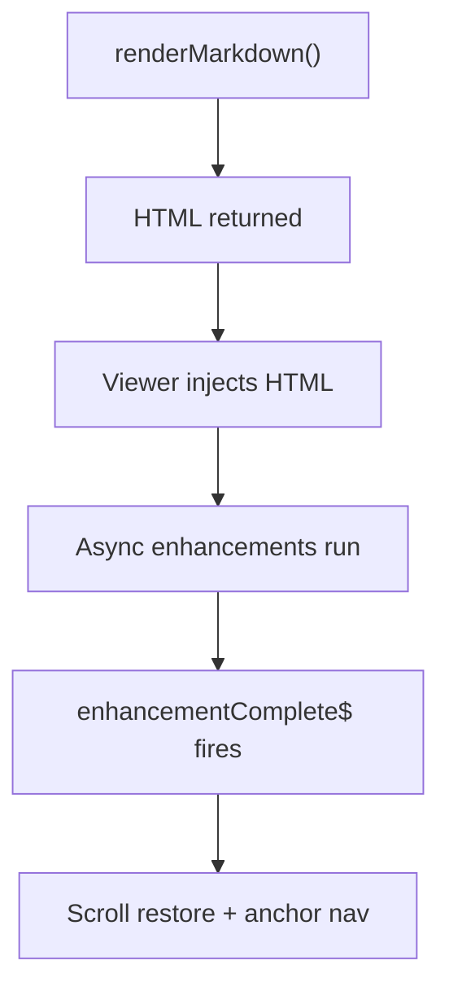

# Contributor (ID:doc30-guide-0100)

How Markdown Rendering Works

docs-viewer + mark-render.service
Welcome!
This guide explains how Markdown is rendered inside the docs viewer, and how the async pipeline works so you can safely extend or modify the system.

## Overview
Rendering Markdown is a four-phase pipeline involving:

Parsing Markdown

Injecting HTML

Running async enhancements

Restoring scroll + anchor navigation

Understanding these phases prevents timing bugs and layout jumps.

1. Renderer: Markdown Parse (sync)
The viewer calls:

```ts
const result = this.markRenderService.renderMarkdown(markdown);
```
This method:

Parses Markdown

Applies custom transforms

Returns HTML immediately

Starts async enhancements internally

Exposes enhancementComplete$

Important:  
HTML is returned before Mermaid, KaTeX, or syntax highlighting run.

2. Viewer: HTML Injection (sync)
The viewer inserts HTML:

```ts
this.markdownContainer.nativeElement.innerHTML = result.html;
```
At this moment:

The DOM is live

Enhancements have not run

Layout is not stable

Do not run scroll restoration here.

3. Renderer: Async Enhancements
The renderer runs:

runMermaid()

runKatex()

runSyntaxHighlighting()

patchTablesForTheme()

These mutate the DOM and change layout height.

When all enhancements finish, the renderer emits:

```ts
enhancementComplete$.next();
```
4. Viewer: Layout-Sensitive Logic
The viewer waits for:

```ts
result.enhancementComplete$.subscribe(() => {
  this.restoreScrollPosition();
  this.navigateToAnchorIfPresent();
});
```
This ensures:

Scroll restoration is correct

Anchor navigation lands on the right element

No layout jumps occur

Rules for Contributors
If you modify the viewer:
Never run scroll logic before enhancementComplete$

Never assume HTML injection means layout is stable

If you modify the renderer:
Treat all enhancements as async

Emit enhancementComplete$ only when:

Mermaid is done

KaTeX is done

Syntax highlighting is done

Table patches are done

Microtasks have settled

If you add a new enhancement:
Add it inside the renderer

Include it in the enhancement completion pipeline

Do not run enhancements in the viewer

---
Visual Summary


## [Lifecycle Chelist](#docId:guide-020)

## [Contributor Onboarding Quickstart](#docId:guides-030)
