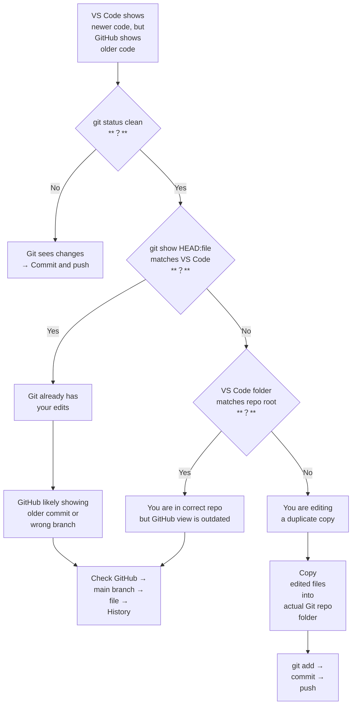
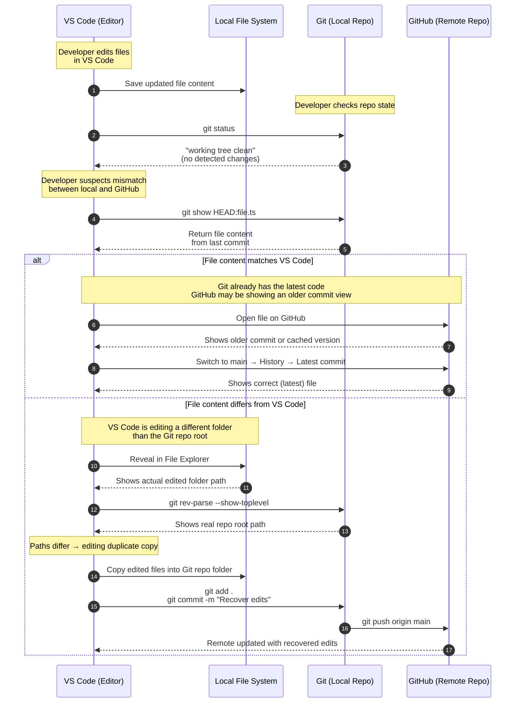

# Git Troubleshooting Guide

---
When Local Code Doesn’t Match GitHub (But git status Says Clean)
This guide explains how to diagnose and resolve one of the most confusing Git scenarios:

- VS Code shows newer edits
- GitHub shows older code
- git status says clean
- git push does nothing
- You suspect a “missing commit”

This situation usually happens when Git and your editor are not looking at the same files — or when GitHub is showing an older commit view.

This guide provides a clear, step‑by‑step workflow to identify the cause and recover your work safely.

## 1. Verify You Are Inside a Git Repository

__Command__
```
git rev-parse --show-toplevel
```
__Interpretation__
|Output	|Meaning|
|-------|-------|
|A folder path	|You are inside a Git repo. This is the repo root.|
|Nothing / error	|You are not inside a Git repo. Git cannot see your edits.|

__Why this matters__

If you are editing files outside the repo folder, Git will never detect changes.

## 2. Check Whether Git Detects Any Changes

__Command__
```
git status
```
__Interpretation__

|Output	|Meaning|
|-------|-------|
|nothing to commit, working tree clean	|Git sees no changes. <br>&emsp;• Either your edits are already committed, <br>&emsp;• or you are editing a different folder.|
|Modified files listed	|Git sees your edits. You can commit normally.|

## 3. Compare VS Code’s File With Git’s File

If VS Code shows newer code but GitHub shows older code, inspect what Git actually has stored.

__Command__

```
git show HEAD:path/to/file.ts
```
__Interpretation__

|Result	|Meaning|
|-------|-------|
|Output matches VS Code	|Your edits are already committed. <br>GitHub may be showing an older commit view.|
|Output is older than VS Code	|You are editing a different folder than the Git repo.|

## 4. Confirm the Folder VS Code Is Editing

__In VS Code__

Right‑click the file tab → Reveal in File Explorer

This shows the exact folder containing your edits.

__Compare with Git repo root__

Check if the path matches the output of:

```
git rev-parse --show-toplevel
```

__Interpretation__

|Paths match	|Paths differ|
|-------------|------------|
|You are editing the correct Git repo	|You are editing a duplicate copy of the project|

## 5. If Paths Differ: Recover Your Edits

If VS Code is editing a different folder:

1. Open both folders in File Explorer
2. Copy the edited files (or entire src/) into the Git repo folder
3. Commit and push:

```
    git add .
    git commit -m "Recover missing edits"
    git push origin main --force-with-lease
```
This restores your real repo to the correct state.

## 6. If Paths Match: Why GitHub Shows Older Code

If both paths match but GitHub shows older code:

- You may be viewing an older commit on GitHub
- You may be looking at a PR diff, not the main branch
- GitHub’s UI may be showing cached content
- You may be on a different branch on GitHub

__Fix__

On GitHub:

1. Switch to the main branch
2. Navigate to the file
3. Click History
4. Click the latest commit
5. View the file at that commit

You may or may not see the same content as your local file:

- If you see, GitHub was showing an older commit or cached view
- if you do not see, You are on the wrong branch on GitHub


## 7. Decision Tree (Quick Diagnosis)

```
VS Code shows new code
        ↓
git status clean?
        ↓ yes
git show HEAD:file matches VS Code?
        ↓ yes
GitHub is showing an older commit → check branch/history
        ↓ no
You are editing a different folder → copy files into repo root
```

## 8. Common Causes of This Problem

This mismatch typically occurs when:

- You opened a duplicate copy of the project in VS Code
- You cloned the repo twice
- You moved folders manually
- You opened a parent folder instead of the repo root
- You used OneDrive/Desktop folders that sync differently
- You switched branches without committing
- You edited files in a build output folder (dist/, etc.)

## 9. Best Practices to Avoid This

- Always check the repo root with ```git rev-parse --show-toplevel```
- Always open the repo root folder in VS Code
- Avoid editing files inside OneDrive/Desktop unless necessary
- Use ```git status``` frequently
- Use ```git branch --show-current``` to confirm your branch
- Use ```git show HEAD:file``` to verify what Git actually has


# Git Troubleshooting Flowchart

---

## How to Use This Flowchart

This diagram mirrors the troubleshooting checklist:

- Start at the top when you notice a mismatch
- Follow the decision diamonds
- Each branch leads to a clear action
- The flow ends at one of three outcomes:

1. Your edits are already committed

> GitHub is showing an older commit view.

2. You were editing a duplicate folder

> Copy files into the real repo and commit.

3. Git sees your changes normally

> Just commit and push.


# Git Troubleshooting — Sequence Diagram

---
VS Code vs. Git vs. GitHub (When Local Code Doesn’t Match Remote)



## What This Diagram Communicates
This sequence diagram captures the exact diagnostic flow you went through:

1. VS Code writes edits to disk
But Git may not detect them if they’re in the wrong folder.

2. Git reports “clean”
Meaning: no changes in the repo folder.

3. git show HEAD:file reveals Git’s version
This is the authoritative version Git knows about.

4. Two possible branches:

> A. Git’s version matches VS Code

>> → GitHub is showing an older commit view

>> → Fix by checking GitHub’s branch and commit history

> B. Git’s version does NOT match VS Code

>> → VS Code is editing a different folder

>> → Fix by copying edited files into the real repo root

>> → Commit and push

## Why This Diagram Matters

This sequence diagram:

- Makes the troubleshooting flow visual and explicit
- Shows the exact interactions between tools
- Helps contributors understand where mismatches occur
- Clarifies the difference between:

>- Editor state
>- File system state
>- Git index state
>- GitHub remote state
