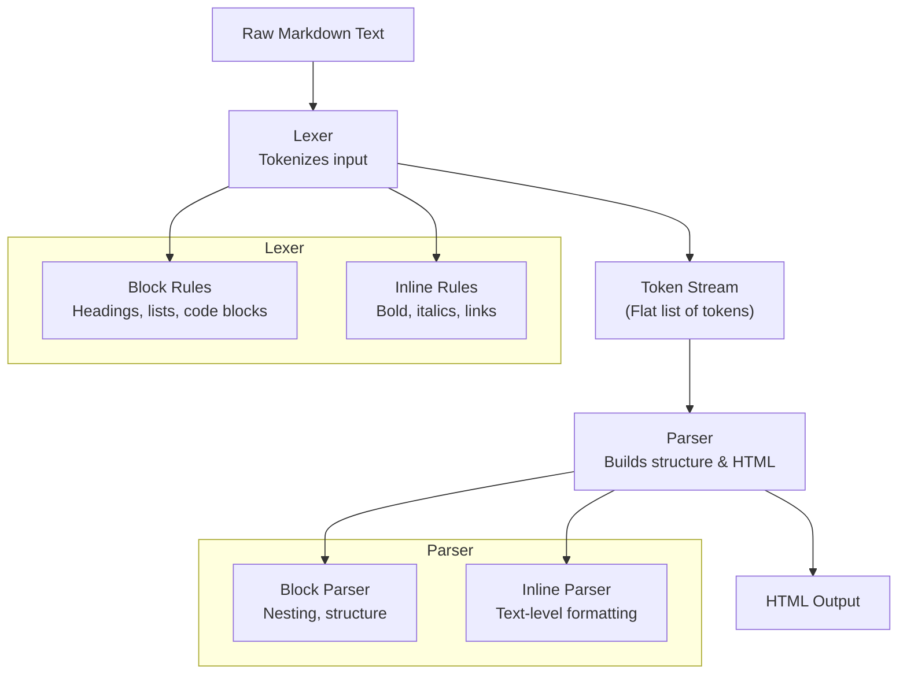
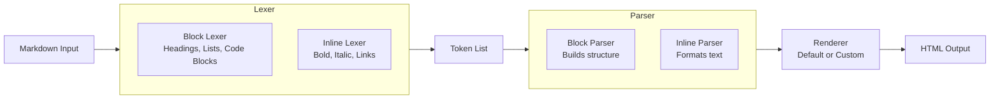
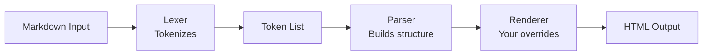
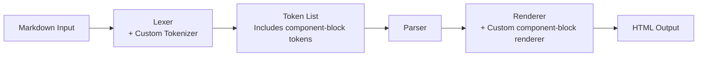
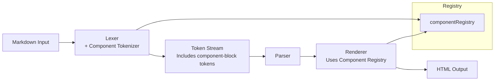
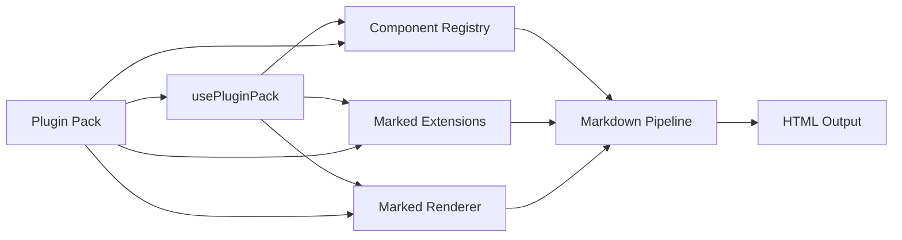

# Lexer vs Parser — The Big Picture


Here’s a clean, conceptual explanation of lexer vs parser, and then how they show up in a real-world library like Marked, the popular Markdown parser.

For example, Think of a compiler or interpreter as a two‑stage reader:

---
## 1. Lexer (Tokenizer)

The __lexer__ takes raw text and breaks it into meaningful tokens.

Tokens are the smallest units that have meaning in the language.

### What the lexer does

- Reads characters one by one
- Groups them into tokens (e.g., `#, **bold**, - list item`)
- Removes irrelevant details like whitespace
- Does no structural understanding — it just labels pieces

### Example (Markdown)

Input:

```
# Hello **world**
```

Lexer output (tokens):

|Token Type	|Value |
|-----------|------|
|heading	|# |
|text	|Hello |
|strong_start	|** |
|text	|world |
|strong_end	|** |

The lexer doesn’t know what a “heading” means — it just recognizes patterns.

---
## 2. Parser

The __parser__ takes the tokens from the lexer and builds a structured representation, usually an __AST (Abstract Syntax Tree)__.

### What the parser does

- Understands grammar rules
- Builds hierarchy (e.g., headings contain text, lists contain list items)
- Validates structure
- Produces a tree that represents meaning

### Example (Markdown)

Parser output (AST):

```
    Heading(level=1)
    └── Paragraph
          ├── Text("Hello ")
          └── Strong
              └── Text("world")
```

Now the structure is explicit and ready for rendering (HTML, PDF, etc.).

---
## 3. How Marked Uses Lexer and Parser

Marked is a Markdown-to-HTML library.

Internally, it follows the classic two‑stage pipeline:

```
Markdown → Lexer → Tokens → Parser → HTML
```

Let’s break down each part.

### Marked’s Lexer

Marked’s lexer scans the Markdown text and produces a flat list of tokens.

Examples of token types Marked emits:

- heading
- paragraph
- list_start
- list_item
- strong
- em
- code
- blockquote
- hr

Each token includes metadata, e.g.:

```json
  {
    "type": "heading",
    "depth": 1,
    "text": "Hello world"
  }
```
The lexer is responsible for:

- Recognizing Markdown syntax
- Handling block-level constructs (lists, code blocks, blockquotes)
- Handling inline constructs (bold, italics, links)

But it does not build nested structures — that’s the parser’s job.

## Marked’s Parser

The parser takes the token list and converts it into HTML.

__What it does:__

- Walks through the token list
- Builds nested structures (e.g., lists inside blockquotes)
- Converts tokens into HTML strings
- Delegates inline parsing to its inline parser

__Example:__

Token:

```
  { "type": "heading", "depth": 1, "text": "Hello world" }
```

Parser output:

`<h1>Hello world</h1>`

The parser understands:

- Which tokens can contain other tokens
- How to handle nesting
- How to produce valid HTML

---
## 4. Why Split Lexer and Parser?

This separation is not just academic — it’s practical:

### Benefits

- Cleaner architecture  

> Each stage has a single responsibility.

- Easier to extend  

> You can customize tokenization or parsing independently.

- Better performance

> Tokenization is linear and fast; parsing can optimize structure.

- More predictable behavior  

> Markdown is messy; splitting concerns helps maintain order.

Marked follows this classic design because Markdown has many ambiguous patterns, and separating lexing from parsing makes the system maintainable.

### A Simple Analogy

Imagine reading a recipe:

__Lexer__

You identify words:
“2”, “cups”, “flour”, “mix”, “bowl”.

__Parser__

You understand structure:

- Ingredient list
- Steps
- Quantities
- Actions

The lexer sees words.
The parser sees meaning.

---
## 5. Marked’s Lexer–Parser Pipeline



### more explicit architectural view:

This mirrors Marked’s actual code organization:

- Lexer → Tokens
- Parser → Renderer
- InlineLexer for inline formatting


You get:

- Separation of concerns  

> Tokenization is isolated from structural interpretation.

- Extensibility  

> You can override the renderer without touching the lexer.

- Predictability  

> Markdown is ambiguous; splitting stages keeps behavior stable.

- Performance  

> Tokenization is linear; parsing can optimize structure.

This is why Marked remains one of the fastest Markdown parsers.

---
## 6. Custome Renderer Exapmples(Marked)

### 6-1. Basic Custom Renderer

__input:__
```typescript
  import { marked } from "marked";

  const renderer = {
    heading(text, level) {
      return `<h${level} class="my-heading">${text}</h${level}>`;
    },

    paragraph(text) {
      return `<p class="my-paragraph">${text}</p>`;
    }
  };

  marked.use({ renderer });

  const html = marked.parse("# Hello\n\nThis is a paragraph.");
  console.log(html);

```
__output:__
```typescript
  &lt;h1 class="my-heading">Hello&lt;/h1>
  &lt;p class="my-paragraph">This is a paragraph.&lt;/p>

```

### 6-2. A More Expressive Override
```typescript
  const renderer = {
    heading(text, level) {
      return `
        &lt;section class="doc-heading level-${level}">
          &lt;h${level}>${text}&lt;/h${level}>
        &lt;/section>
      `;
    },

    code(code, infostring) {
      const lang = infostring || "text";
      return `
        &lt;pre class="code-block language-${lang}">
          &lt;code>${code}&lt;/code>
        &lt;/pre>
      `;
    }
  };

```

### 6-3. Using a Renderer with Marked

Marked’s plugin system uses .use():
```typescript
  marked.use({ renderer });

```
You can combine this with other extensions:
```typescript
  marked.use({
    renderer,
    gfm: true,
    breaks: true
  });

```
### 6-4. Renderer Method Reference (Most Common)

|Method	|Called When |
|-------|------------|
|heading(text, level)	|#, ##, ###… |
|paragraph(text)	|Plain text blocks |
|strong(text)	|`**bold**` |
|em(text)	|`*italic*` |
|codespan(code)	|Inline code |
|code(code, lang)	|Fenced code blocks|
|link(href, title, text)	|`[text](url)`|
|list(body, ordered)	|Lists|
|listitem(text)	|List items|
|blockquote(text)	|`> quote`|

You override only what you need.

### 6-5. Where the Renderer Sits in the Pipeline

Here’s a quick visual to anchor it in your architectural model:

The renderer is the final transformation stage — perfect for theming, documentation systems, or custom output formats.

---
## 7. a custom Markdown component system(Example)

Create a system where authors can write:
```
  :::note
  This is a note block.
  :::

```
And Markdown pipeline outputs:
```typescript
  &lt;aside class="note">
    &lt;p>This is a note block.&lt;/p>
  &lt;/aside>

```
Then we’ll do this by extending Marked’s tokenizer + renderer:

### Step-1

Marked allows you to define custom block-level tokens.

We’ll create a rule that recognizes :::type blocks.
```typescript
  const noteExtension = {
    extensions: [
      {
        name: "component-block",
        level: "block", // block-level tokenizer
        start(src) {
          return src.match(/:::/)?.index;
        },
        tokenizer(src) {
          const rule = /^:::(\w+)\n([\s\S]+?)\n:::/;
          const match = rule.exec(src);

          if (match) {
            return {
              type: "component-block",
              raw: match[0],
              component: match[1],
              text: match[2].trim()
            };
          }
        }
      }
    ]
  };

```
#### What this does

- Detects blocks starting with :::something
- Captures the component name (note, warning, etc.)
- Captures the inner Markdown content
- Emits a custom token the parser will understand

This is “lexer extension.”

### Step-2

Now we tell Marked how to turn that token into HTML.
```typescript
  const renderer = {
    "component-block"(token) {
      return `
        <aside class="${token.component}">
          ${marked.parse(token.text)}
        </aside>
      `;
    }
  };

```
#### Why this works

- The renderer receives your custom token
- It wraps the inner content in a component container
- It recursively parses the inner Markdown (marked.parse(token.text))

This is “view layer.”

### Step-3

```typescript
  import { marked } from "marked";

  marked.use(noteExtension);
  marked.use({ renderer });

```
Now your Markdown pipeline understands custom components.

### Step-4

```typescript
  const md = `
  # Example

  :::note
  This is a **note** block.
  :::
  `;

  console.log(marked.parse(md));

```

__output:__

```typescript
  &lt;h1>Example&lt;/h1>
  &lt;aside class="note">
    &lt;p>This is a &lt;strong>note&lt;/strong> block.&lt;/p>
  &lt;/aside>

```

### Architectural View

You’re extending the lexer and renderer, but not the parser — Marked handles the structural flow for you.

### Why This Pattern Scales

This approach gives you:

__✔ A domain-specific Markdown__ 

You can define components like:
```
  :::warning
  Be careful.
  :::

```
__✔ A clean separation of concerns__

- Tokenizer: recognizes syntax
- Renderer: defines output
- Parser: stays untouched

__✔ A contributor-friendly system__

Writers use simple Markdown.

Developers extend behavior with small, isolated rules.

---
## 8. A Component Registry System(Example)

__Goal: Create a system where contributors can register components like__
```
  :::note
  Content
  :::
``` 
or
```
  :::warning
  Be careful
  :::
```
…by adding a single entry to a registry:

```typescript
  registerComponent("note", { tag: "aside", class: "note" });

```

### 8-1. The Component Registry

A simple in‑memory registry:

```typescript
const componentRegistry = {};

export function registerComponent(name, config) {
  componentRegistry[name] = {
    tag: config.tag || "div",
    class: config.class || name,
    render: config.render || null
  };
}
```

__What this gives you__

- A central place to define components
- Defaults for tag + class
- Optional custom render functions for advanced components

### 8-2. Tokenizer That Uses the Registry

We extend Marked’s tokenizer so it recognizes any registered component:

```typescript
  const componentExtension = {
    extensions: [
      {
        name: "component-block",
        level: "block",
        start(src) {
          return src.match(/:::/)?.index;
        },
        tokenizer(src) {
          const rule = /^:::(\w+)\n([\s\S]+?)\n:::/;
          const match = rule.exec(src);

          if (!match) return;

          const component = match[1];
          if (!componentRegistry[component]) return;

          return {
            type: "component-block",
            raw: match[0],
            component,
            text: match[2].trim()
          };
        }
      }
    ]
  };

```

__Key idea__

The tokenizer only accepts components that exist in the registry.
This prevents typos from silently becoming HTML.

### 8-3. Renderer That Uses the Registry

```typescript
const renderer = {
  "component-block"(token) {
    const def = componentRegistry[token.component];

    // Custom render function (optional)
    if (def.render) {
      return def.render(token);
    }

    // Default rendering
    return `
      <${def.tag} class="${def.class}">
        ${marked.parse(token.text)}
      </${def.tag}>
    `;
  }
};
```

__Why this is powerful__

- Components can override rendering
- Or fall back to a simple tag/class wrapper
- Inner Markdown is recursively parsed


### 8-4. Register Components

```typescript
  registerComponent("note", {
    tag: "aside",
    class: "note"
  });

  registerComponent("warning", {
    tag: "aside",
    class: "warning"
  });

  // Advanced component with custom render
  registerComponent("callout", {
    render(token) {
      return `
        <div class="callout">
          <strong>Callout:</strong>
          ${marked.parse(token.text)}
        </div>
      `;
    }
  });

```

### 8-5. Plug Everything Into Marked

```typescript
  import { marked } from "marked";

  marked.use(componentExtension);
  marked.use({ renderer });

```

### 8-6. Example Markdown

```
  :::note
  This is a note.
  :::

  :::warning
  This is a warning.
  :::

  :::callout
  This is a custom-rendered callout.
  :::

```

__Output__

```
  &lt;aside class="note">
    &lt;p>This is a note.&lt;/p>
  &lt;/aside>

  &lt;aside class="warning">
    &lt;p>This is a warning.&lt;/p>
  &lt;/aside>

  &lt;div class="callout">
    &lt;strong>Callout:&lt;/strong>
    &lt;p>This is a custom-rendered callout.&lt;/p>
  &lt;/div>

```

__🧭 Architectural Diagram (Mermaid)__


This shows the registry as a shared dependency for both tokenizer and renderer.

__🎁 Why This System Works So Well__

✔ Declarative

Contributors add components without touching core logic.

✔ Extensible

- Each component can define:
- tag
- class
- custom render function

✔ Safe

Tokenizer only accepts registered components.

✔ Familiar

Feels like MDX/VuePress, but simpler and fully Markdown‑driven.

<br>

---
## 9. Plugin Pack System(Example)

Here’s a clean, extensible plugin pack system for your Markdown component architecture — the kind of thing that lets contributors drop in a whole suite of components with a single .use() call. This turns your Markdown pipeline into a modular ecosystem, much like how remark/rehype plugins or VuePress theme packs work, but with the simplicity of Marked.

__🌐 What We’re Building__

- A plugin pack is a bundle of:
- multiple components
- optional tokenizer extensions
- optional renderer overrides
- optional configuration

Contributors can install it like:
```typescript
  import { usePluginPack } from "./plugin-system.js";
  import { docsComponents } from "./docs-pack.js";

  usePluginPack(docsComponents);
```
And suddenly Markdown supports:
```
  :::note
  ...
  :::

  :::warning
  ...
  :::

  :::callout
  ...
  :::
```

### 9-1. Base Component Registry (from previous step)

```typescript
const componentRegistry = {};

export function registerComponent(name, config) {
  componentRegistry[name] = {
    tag: config.tag || "div",
    class: config.class || name,
    render: config.render || null
  };
}
```

### 9-2. Plugin Pack Definition Format

A plugin pack is just a structured object:
```typescript
  export function definePluginPack({ components = [], extensions = [], renderer = {} }) {
    return { components, extensions, renderer };
  }
```

This gives contributors a predictable shape.

### 9-3. Plugin Pack Loader

This is the heart of the system — it installs everything into Marked:
```typescript
  import { marked } from "marked";
  import { registerComponent } from "./component-registry.js";

  export function usePluginPack(pack) {
    // 1. Register components
    for (const c of pack.components) {
      registerComponent(c.name, c.config);
    }

    // 2. Register tokenizer extensions
    if (pack.extensions.length > 0) {
      marked.use({ extensions: pack.extensions });
    }

    // 3. Register renderer overrides
    if (Object.keys(pack.renderer).length > 0) {
      marked.use({ renderer: pack.renderer });
    }
  }
```

This is clean, explicit, and easy to reason about.


### 9-4. Component Tokenizer (shared by all packs)

This is the same tokenizer from your component system — it works for all registered components:
```typescript
  export const componentTokenizer = {
    name: "component-block",
    level: "block",
    start(src) {
      return src.match(/:::/)?.index;
    },
    tokenizer(src) {
      const rule = /^:::(\w+)\n([\s\S]+?)\n:::/;
      const match = rule.exec(src);
      if (!match) return;

      const [raw, component, text] = match;
      return {
        type: "component-block",
        raw,
        component,
        text: text.trim()
      };
    }
  };
```

### 9-5. Component Renderer (shared by all packs)
```typescript
import { marked } from "marked";
import { componentRegistry } from "./component-registry.js";

export const componentRenderer = {
  "component-block"(token) {
    const def = componentRegistry[token.component];

    if (!def) return token.raw; // fallback

    if (def.render) {
      return def.render(token);
    }

    return `
      <${def.tag} class="${def.class}">
        ${marked.parse(token.text)}
      </${def.tag}>
    `;
  }
};
```

### 9-6. Example Plugin Pack: “docsComponents”

This is what contributors will write:
```typescript
  import { definePluginPack } from "./plugin-system.js";
  import { componentTokenizer, componentRenderer } from "./component-core.js";

  export const docsComponents = definePluginPack({
    components: [
      {
        name: "note",
        config: { tag: "aside", class: "note" }
      },
      {
        name: "warning",
        config: { tag: "aside", class: "warning" }
      },
      {
        name: "callout",
        config: {
          render(token) {
            return `
              &lt;div class="callout">
                &lt;strong>Callout:&lt;/strong>
                ${marked.parse(token.text)}
              &lt;/div>
            `;
          }
        }
      }
    ],

    extensions: [componentTokenizer],

    renderer: componentRenderer
  });
```
This is a full plugin pack:

- 3 components
- 1 tokenizer
- 1 renderer


### 9-7. Using the Plugin Pack

```typescript
  import { usePluginPack } from "./plugin-system.js";
  import { docsComponents } from "./docs-pack.js";

  usePluginPack(docsComponents);

  const html = marked.parse(`
  :::note
  Hello
  :::
  `);
```

console.log(html);

__🧭 Architectural Diagram (Mermaid)__



This shows how plugin packs become first-class citizens in your Markdown architecture.

__🎁 Why This Plugin Pack System Works__

✔ Modular

Each pack is self-contained.

✔ Declarative

Contributors define components, not logic.

✔ Extensible

Packs can include:

- components
- tokenizers
- renderers
- future features (shortcodes, directives, etc.)

✔ Composable

Multiple packs can be installed together.

---
## 10. Multi-pack Conflict Resolution System (Example)

Here’s a clean, extensible multi‑pack conflict resolution system for your Markdown component architecture — designed the way you like things: explicit, layered, contributor‑friendly, and easy to reason about.

This system lets you install multiple plugin packs while controlling:

priority (which pack wins when both define the same component)

merge strategy (override, extend, or error)

namespacing (optional isolation)

It’s the kind of foundation that makes your Markdown pipeline feel like a real framework.

### 10-1. Define a Conflict Resolution Policy

We’ll support three strategies:

1. "override"

Later packs replace earlier ones.

2. "preserve"

Earlier packs win; later ones are ignored.

3. "error"

Throw an error if two packs define the same component.

```typescript
  export const ConflictPolicy = {
    OVERRIDE: "override",
    PRESERVE: "preserve",
    ERROR: "error"
  };
```
