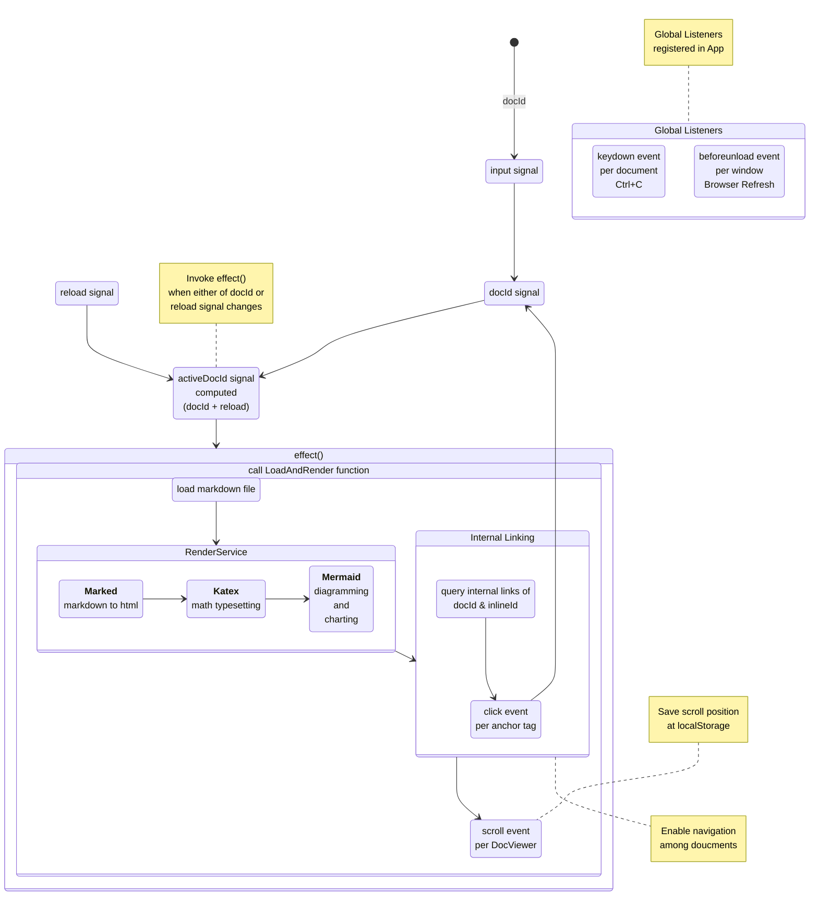

DocsViewer Key Logic Diagram (ID:doc10-app-0110)
============================
---
This diagram shows the DocsViewer’s key logic in effect() which is invoked by input signal and computed signal.

```mermaid

stateDiagram-v2
  direction TB
  
  [*] --> input_signal: docId
  reload_signal: reload signal
  input_signal: input signal
  docId_signal: docId signal
  computed: activeDocId signal<br>computed<br>(docId + reload)
  note left of computed
    Invoke effect() <br>when either of docId or <br>reload signal changes
  end note

  input_signal --> docId_signal
  docId_signal --> computed
  reload_signal --> computed

  computed --> Effect
  Effect: effect()
  state Effect {
    direction TB
    Load
  }

  Listeners: Global Listeners
  state Listeners {
    keydown: keydown event <br>per document<br>Ctrl+C
    beforeunload: beforeunload event<br>per window<br>Browser Refresh
  }
  note left of Listeners
    Global Listeners <br> registered in App
  end note

  Load: call LoadAndRender function

  state Load {
    direction TB
    load: load markdown file
    load --> RenderService
    RenderService --> Links
    Links --> scroll
    scroll: scroll event <br>per DocViewer
  }

  Links: Internal Linking

  clickanchor: click event <br>per anchor tag
  state Links {
    direction LR
    query: query internal links of <br> docId & inlineId
    query --> clickanchor
  }
  clickanchor --> docId_signal

  state RenderService {
    direction LR
    marked: __Marked__ <br>markdown to html
    katex: __Katex__ <br>math typesetting
    mermaid: __Mermaid__ <br>diagramming <br>and<br> charting
    marked --> katex
    katex --> mermaid
  }

  %% state if_firstload <<choice>>
  %% reload: update reload signal
  %% Load --> if_firstload
  %% if_firstload --> reload: if firstload = true
  %% reload --> reload_signal
  
  note right of Links
    Enable navigation <br>among doucments
  end note
  note left of scroll
    Save scroll position <br>at localStorage
  end note

```
