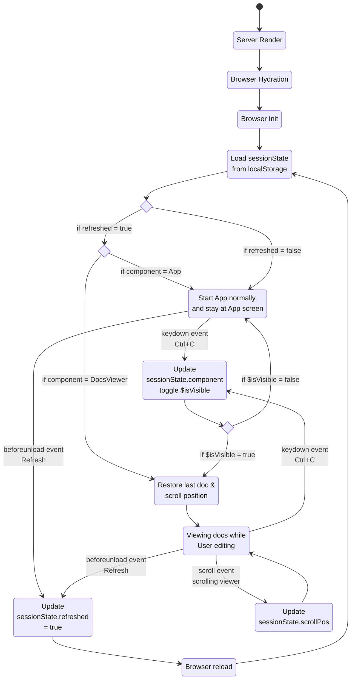

Browser Refresh Recovery (ID: doc10-app-0140)
========================
---

This diagram shows the entire lifecycle of the App’s refresh recovery logic, from SSR → hydration → editing → refresh → recovery.
|                                         |                                                    |
| :-------------------------------------- | :------------------------------------------------- |
| App Component is the orchestrator       | 1. Reads session state once during ngAfterViewInit  |
|                                         | 2. Restores doc + scroll if needed                  |
|                                         | 3. Writes state only at meaningful transitions      |
| ScrollService owns scroll persistence   | 1. Writes scrollPos into sessionState               |
|                                         | 2. Restores scroll when App requests                |
| DocsViewer is purely reactive           | 1. Shows whatever $docId App gives it               |
|                                         | 2. Emits scroll events to ScrollService             |
| localStorage is the single source of State| 1. Holds the unified sessionState                 |
|                                           | 2. No scattered keys                              |
|                                           | 3. No hydration surprises                         |
| Renderer2 listeners are the backbone      | 1. keydown → toggles App ↔ DocsViewer             |
|                                           | 2. beforeunload → marks refres                    |



---

1. loclaStorage stores:
<div class="align-center7">

```ts
(*1)
export interface SessionState {
  component: SessionComponent;
  docId: string | null;
  prevDocId: string | null;
  scrollPos: number;
  refreshed: boolean;
}

Under the ky: sessionState
```
This replaces scattered keys like lastDocId, lastScrollPos, isBrowserRefreshed, etc.

[(*1) See SessionState in th the docs-meta.ts](#docId:docs-meta)
</div>

2. The Session State is updated only at meaningful transitions:

>1. User toggles App ↔ DocsViewer (Ctrl+C)

>>- Update component
>>- Update docId (if needed)

>2. User scrolls inside DocsViewer

>>- Update scrollPos  (ScrollService is responsible for this)

>3. Browser is about to refresh or close

>>- beforeunload sets refreshed = true

3. Session State is read when Hydration is complete, DOM is ready, and scroll restoration is safe, during ngAfterViewInit(), and then:

>1. Normal load → open last component/doc

>2. Refresh on App → clear refresh flag, stay on App

>3. Refresh on DocsViewer → restore doc + scroll position

4. How Refresh Recovery Works:

>- Before refresh

>> beforeunload sets: refreshed = true


>- After refresh, ngAfterViewInit() checks:

>> If refreshed = false → normal startup

>> If refreshed = true:

>>> If component = 'App' → clear state, stay on App

>>> If component = 'DocsViewer' → restore doc and scroll

>> Then always reset: refreshed = false

5. Cleanup Rules

>- Renderer2 listeners
 
>>- keydown
>>- beforeunload  
  Removed in ngOnDestroy() (best effort; hydration may skip destroy).

>- ScrollService

>>- Always reset lastDocId in ngOnDestroy()
>>- Scroll restoration happens only during refresh recovery

>- localStorage, never cleared automatically except when:

>>- App refresh occurs
>>- explicitly calls clearSessionState() (currently not used)

6. Responsibilities by Module

>- App Component

>>- Owns sessionState
>>- Owns refresh detection
>>- Owns restore logic
>>- Owns global listeners

>- ScrollService
 
>>- Writes scrollPos into sessionState
>>- Restores scroll position when asked

>- DocsViewer

>>- Reads $docId and displays the correct document

7. Minimal Mental Model

>- User interacts → sessionState updates
>- Browser refreshes → refreshed=true
>- App loads → restoreFromSessionState()
>- Hydration safe → scroll restored

