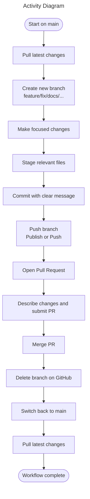
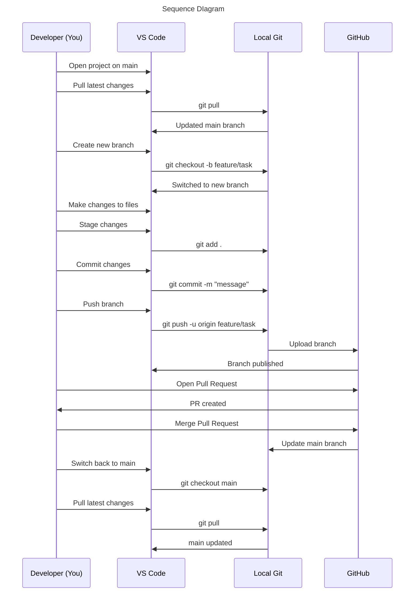
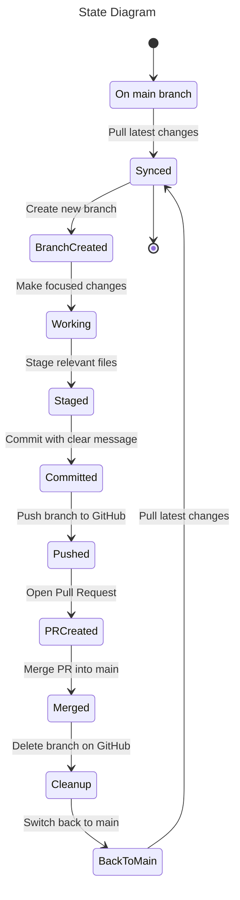
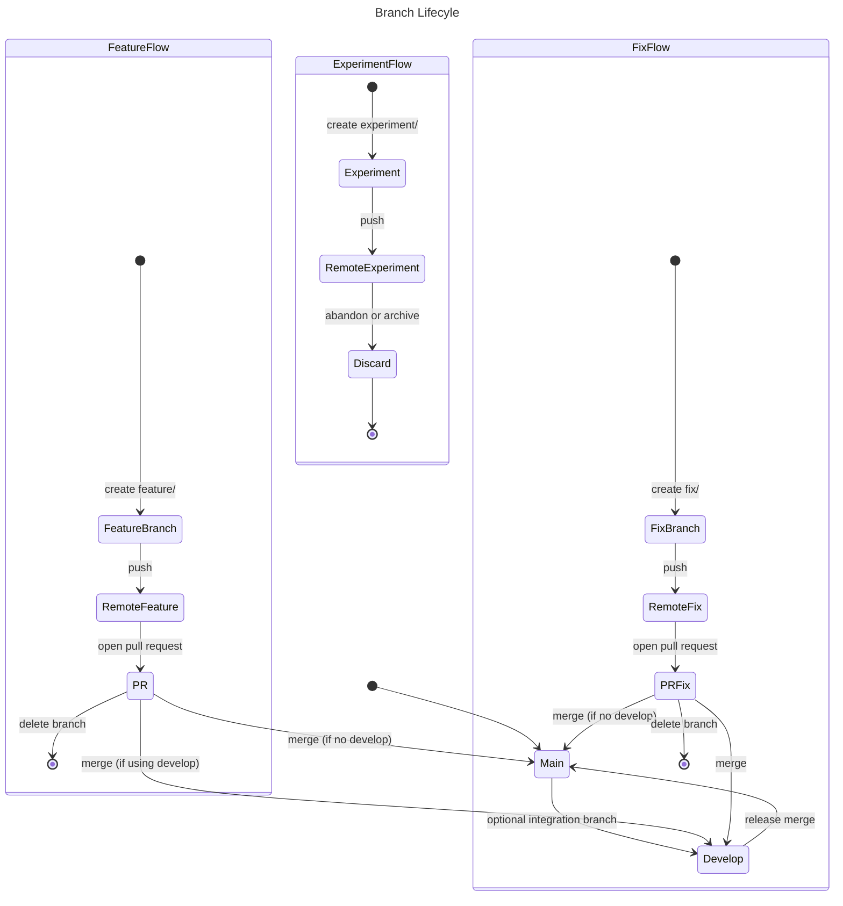

GitHub WorkFflow
====

<h2 id="creating-new-github-repository">🆕 Creating a New GitHub Repository</h2>

next -> [Git Workflow](#inlineId:git-workflow)

last -> [Git Branching Policy](#inlineId:git-branching-policy)

----

1. Create the repo on GitHub

>- Go to GitHub → New Repository
>- Name it (e.g., documentation-system)
>- Choose Public or Private

> Note: Do NOT initialize with README, .gitignore, or license  (This avoids merge conflicts when pushing an existing project.)

2. In your local project folder

>- Open a terminal inside the project root:
    ```bash
    git init
    git add .
    git commit -m "Initial commit"
    ```

3. Connect your local repo to GitHub

>- Copy the repo URL from GitHub (HTTPS or SSH):
    ```bash
    git remote add origin https://github.com/<username>/<repo>.git
    ```

4. Push it
```bash
    git branch -M main
    git push -u origin main
```

That’s it — app is now live on GitHub.

**Note:** 
1. .gitignore file

> What the .gitignore actually does:

>- Folders that will NOT be uploaded: e.g.

>>- /dist
>>- /tmp
>>- /out-tsc
>>- /bazel-out
>>- /node_modules
>>- /.angular/cache
>>- .sass-cache/
>>- /coverage
>>- /typings
>>- __screenshots__/
>>- .idea/, .vscode/* (with exceptions), .history/*

>- Files that will NOT be uploaded:

>>- npm-debug.log
>>- yarn-error.log
>>- .DS_Store
>>- Thumbs.db
>>- libpeerconnection.log
>>- testem.log
>>- Various IDE/editor metadata files

>- Files that will be uploaded:

>> Anything not matched by the patterns above. For example:
>>- Your Angular source code (src/)
>>- Your documentation markdown files
>>- Your scripts
>>- Your configuration files (angular.json, package.json, etc.)
>>- Your README, ADRs, diagrams, onboarding docs

>- A Subtle Detail: The .vscode Exceptions
>> Your .gitignore says:

>>> Code

>>> .vscode/*

>>> !.vscode/settings.json

>>> !.vscode/tasks.json

>>> !.vscode/launch.json

>>> !.vscode/extensions.json

>>> Meaning:

>>> Everything in .vscode/ is ignored except those four files.

>> This is a common pattern for sharing workspace settings without leaking personal editor clutter.

> ***How to double-check locally*** 
```bash
    git status --ignored
```

2. External Code Attribution

>1. Full Files

>> When an entire file originates from another author (with or without modifications), <u>include this header at the top of the file</u>:
```ts
        /**
         * Original work by: <Author Name>
         * Source: <URL>
         * License: <License Name>
         * Notes: <Describe modifications or adaptation>
         */
```

>2. Functions or Snippets

>> When only a function or small block is reused, <u>place this comment directly above it</u>>:

```ts
        // Based on an implementation by <Author Name> (<License Name>)
        // Source: <URL>
```

>3. Conceptual Inspiration

>> When the idea came from external work but the implementation is original:

```ts
        // Inspired by an approach from <Author Name>
        // Source: <URL>
```

>4. Centralized Credits (Optional)

>> If multiple external sources are used, they may also be listed in a Credits section:

```Code
        ## Credits
        This project includes or adapts code from the following sources:

        - <\ Author Name >\ - <\Project Name>\  
          License: <\License Name>\  
          Source: <\URL>\

        - <\Author Name>\ — <\Project Name>\
          License: <\License Name>\
          Source: <\URL>\
```

>5. License Preservation

>> When external code is included:

>>- Preserve the original author’s copyright notice
>>- Preserve the original license text (MIT, Apache, BSD, etc.)
>>- Do not remove or alter required notices
>>- Add a NOTICE file if the license requires it (e.g., Apache 2.0)


---
<h2 id="git-workflow">🌿 Git Workflow</h2>

previous ->  [Creating a New GitHub Repository](#inlineId:creating-new-github-repository)

next ->  [Git Branching Policy](#inlineId:git-branching-policy)

----

|Step |Action	                  |Purpose                   |
|:----|:------------------------|:-------------------------|
|1	| Start on main	| Ensure local repo macthes GitHub:<br>&emsp; • Switch to main<br>&emsp; • Pull latest changes|
|2	| Create a task branch	| Isolate work and keep history clean:<br>&emsp; • Create new branch: feature/..., fix/..., docs/...<br>&emsp; • Publish the branch |
|3	| Make focused changes	| Avoid mixing unrelated changes:<br>&emsp; • Edit only files related to the task|
|4	| Commit cleanly 	| Maintain readable, reversible history:<br>&emsp; • Stage only relevant files<br>&emsp; • Commit using message format:<br>&emsp;&emsp; ```type(scope): short description```|
|5	| Push the branch | Make your work visible on GitHub:<br>&emsp; • Publish branch (first push)<br>&emsp; • Push updates (later pushes)|
|6	| Open a Pull Request(PR)	| Review and integrate work into main:<br>&emsp; • Compare & pull request<br>&emsp; • Describe what changed and why<br>&emsp; • Merge when ready  |
|7	| Clean up	| Keep repo tidy and stay synced:<br>&emsp; • Delete branch on GitHub<br>&emsp; • Switch back to main<br>&emsp; • Pull latest changes|


1. Start on main and sync

>- Switch to the main branch in VS Code
>- Pull the latest changes (or click Sync Changes)
>- Confirm the working directory is clean

> ***Purpose: ensures ther local environment matches the remote repository. before starting new work***

2. Create a new branch for a task

>- Click the branch name in the bottom-left of VS Code
>- Select Create new branch
>- Use a descriptive name(examples):

>>- feature/scroll-restoration
>>- fix/markdown-renderer
>>- docs/adr-print-mode

> VS Code switches to the new branch automatically

> ***Purpose: isolates each task, keeps the history clean, and makes PRs easy to review.***

3. Make focused changes

>- Edit files normally
>- Avoid mixing unrelated changes in the same branch

> ***Purpose: akeeps commits meaningful and PRs easy to understand.***

4. Commit changes

>- Open the Source Control panel:
>- Stage only the files (click the + next to each file or next to Changes)
>- Write a clear commit message, and typcal message format:
```Code
        type(scope): short description
```
>> Examples:
```Code
        feat(scroll): implement scroll restoration
        fix(renderer): resolve KaTeX wrapping issue
        docs(adr): add print-mode architecture ADR
```

>- Click ✔ Commit

> ***Purpose: creates a readable, reversible history that future contributors can follow.***

5. Push branch

>- Click Publish Branch (for new branches), or Click the ↑ Push icon

> ***Purpose: uploads the branch to GitHub so it becomes visible for review.***

6. Verify branch on GitHub

>- On GitHub:

>>- Open the repository
>>- Go to the Branches tab
>>- Confirm the branch appears alongside main

>- GitHub will show:

>>- “Compare & pull request”

> ***Purpose: ensures the branch exists remotely and is ready for a PR.***

7. Open a Pull Request (PR)

>- Click Compare & pull request
>- Write a clear description of what changed and why
>- Add screenshots or diagrams if helpful
>- Submit the PR
>- Merge when ready

> ***Purpose: documents the change , enables review, and integrates the work into main.***

8. Delete the branch after merging

>- On GitHub:

>>- Click Delete branch after merge

>- In VS Code:

>>- Switch back to main
>>- Pull the latest changes

> ***Purpose: keeps the repository tidy and ensures the local environment stayes with the remote.***

---



---



---


----

<h2 id="git-branching-policy">🌿 Git Branching Policy</h2>

top -> [Creating a New GitHub Repository](#inlineId:creating-new-github-repository)

previous -> [Git Workflow](#inlineId:git-workflow)

----

This repository follows a lightweight, contributor‑friendly branching strategy designed to keep development fast, isolated, and easy to review. All work happens in short‑lived branches, and every change enters the codebase through a pull request.

1. Main Branches

> main

- Always stable and deployable
- POnly updated through pull requests
- Represents the latest production‑ready state

> develop (optional; use only if multiple contributors work in parallel)

- Integration branch for upcoming releases
- Features merge here before being promoted to main
- CI runs full test suite on every merge

> If the project is small or you prefer simplicity, skip develop and merge feature branches directly into main.

2. Working Branches

> If the project is small or you prefer simplicity, skip develop and merge feature branches directly into main.

> Branch types:

| Type	| Naming Convention	| Purpose |
|:------------|:-----------------|:-----------------|
| Feature	| feature/ | New functionality or enhancements |
| Fix	| fix/ | Bug fixes or patches |
| Refactor | refactor/ | Structural or code‑quality improvements |
| Experiment(*1) | experiment/ | Spikes, prototypes, or exploratory work |

>> Note *1: Experimental Work such as prototypes or uncertain ideas:
>>- Use experiment/<idea>
>>- Push if you want to share or back up your work
>>- Merge only if the experiment becomes a real feature
>>- Otherwise, delete the branch when done
>>> ***This keeps the main history clean while supporting exploration.***

> Rules for Working Branches:

>- Keep branches focused and scoped
>- Commit as often as needed
>- Push freely (CI will validate your work)
>- Open a pull request when the work is complete
>- Delete the branch after merge

3. Pull Request Workflow

>1. Create a branch from main (or develop)
>2. Commit and push your changes
>3. Open a pull request
>4. Provide a clear summary, motivation, and testing notes
>5. Request review if needed
>6. Squash merge to keep history clean
>7. Delete the branch after merge

> Note: ***Pull requests should be small, focused, and easy to review. Large changes should be split into multiple branches.***
----


