🆕 Creating a New GitHub Repository
==================================
1. Create the repo on GitHub

>- Go to GitHub → New Repository
>- Name it (e.g., documentation-system)
>- Choose Public or Private

> Note: Do NOT initialize with README, .gitignore, or license  (This avoids merge conflicts when pushing an existing project.)

2. In your local project folder

>- Open a terminal inside the project root:
    ```bash
    git init
    git add .
    git commit -m "Initial commit"
    ```

3. Connect your local repo to GitHub

>- Copy the repo URL from GitHub (HTTPS or SSH):

    ```bash
    git remote add origin https://github.com/<username>/<repo>.git
    ```

4. Push it

```bash
    git branch -M main
    git push -u origin main
```

That’s it — your app is now live on GitHub.

Note: 
1. .gitignore file

> What the .gitignore actually does:

>>- Folders that will NOT be uploaded: e.g.

>>>- /dist
>>>- /tmp
>>>- /out-tsc
>>>- /bazel-out
>>>- /node_modules
>>>- /.angular/cache
>>>- .sass-cache/
>>>- /coverage
>>>- /typings
>>>- __screenshots__/
>>>- .idea/, .vscode/* (with exceptions), .history/*

>>- Files that will NOT be uploaded

>>>- npm-debug.log
>>>- yarn-error.log
>>>- .DS_Store
>>>- Thumbs.db
>>>- libpeerconnection.log
>>>- testem.log
>>>- Various IDE/editor metadata files

>>- Files that will be uploaded

>>> Anything not matched by the patterns above.
>>>> For example:
>>>- Your Angular source code (src/)
>>>- Your documentation markdown files
>>>- Your scripts
>>>- Your configuration files (angular.json, package.json, etc.)
>>>- Your README, ADRs, diagrams, onboarding docs

>>- A Subtle Detail: The .vscode Exceptions
>>> Your .gitignore says:

      Code
      .vscode/*
      !.vscode/settings.json
      !.vscode/tasks.json
      !.vscode/launch.json
      !.vscode/extensions.json
      Meaning:

      Everything in .vscode/ is ignored except those four files.

      This is a common pattern for sharing workspace settings without leaking personal editor clutter.

> ***How to double-check locally***

    ```bash
    git status --ignored
    ```

2. External Code Attribution

>1. Full Files
>> When an entire file originates from another author (with or without modifications), <u>include this header at the top of the file</u>:

    ```ts
    /**
     * Original work by: <Author Name>
     * Source: <URL>
     * License: <License Name>
     * Notes: <Describe modifications or adaptation>
     */
    ```

>2. Functions or Snippets

>> When only a function or small block is reused, <u>place this comment directly above it</u>>:

      ```ts
      // Based on an implementation by <Author Name> (<License Name>)
      // Source: <URL>

      ```

>3. Conceptual Inspiration

>> When the idea came from external work but the implementation is original:

      ```ts
      // Inspired by an approach from <Author Name>
      // Source: <URL>

      ```

4. Centralized Credits (Optional)

> If multiple external sources are used, they may also be listed in a Credits section:

      ```code
      ## Credits
      This project includes or adapts code from the following sources:

      - <Author Name> — <Project Name>  
        License: <License Name>  
        Source: <URL>

      - <Author Name> — <Project Name>  
        License: <License Name>  
        Source: <URL>

      ```


---
🌿 Clean Git Workflow
======================

1. Start on main and sync

- Switch to the main branch in VS Code
- Pull the latest changes (or click Sync Changes)
- Confirm your working directory is clean

> ***Purpose: ensures your local environment matches the remote repository.***

2. Create a new branch for your task

- Click the branch name in the bottom-left of VS Code
- Select Create new branch
- Use a descriptive name:
- feature/scroll-restoration
- fix/markdown-renderer
- docs/adr-print-mode
- VS Code automatically switches you to the new branch.

> ***Purpose: isolates your work and keeps the history clean.***

3. Make your changes

- Edit files normally
- Keep changes focused on the task the branch represents

> ***Purpose: avoids mixing unrelated changes.***

4. Commit your changes

- Open the Source Control panel:
- Stage files (click the + next to each file or next to Changes)
- Write a clear commit message
- Click ✔ Commit
- Commit message format:

```Code
type(scope): short description
```
Examples:
```Code
feat(scroll): implement scroll restoration
fix(renderer): resolve KaTeX wrapping issue
docs(adr): add print-mode architecture ADR
```

> ***Purpose: creates a readable, reversible history.***

5. Push your branch

- Click Publish Branch (for new branches), or Click the ↑ Push icon

> ***Purpose: uploads your branch to GitHub so it becomes visible remotely.***

6. Verify your branch on GitHub

>- On GitHub:

>>- Open your repository
>>- Go to the Branches tab
>>- Confirm your branch appears alongside main

>- GitHub will show:

>>- “Compare & pull request”

> ***Purpose: ensures your branch exists on the remote and is ready for review.***

7. Open a Pull Request (PR)

>- Click Compare & pull request
>- Write a clear description of what changed and why
>- Add screenshots or diagrams if helpful
>- Submit the PR
>- Merge when ready

> ***Purpose: documents the change and provides a review checkpoint.***

8. Delete the branch after merging

>- On GitHub:

>>- Click Delete branch after merge

>- In VS Code:

>>- Switch back to main
>>- Pull the latest changes

> ***Purpose: keeps the repository tidy and ensures your local environment is up to date.***

```mermaid
---
title: Clean Git Workflow
---
flowchart TD

    A[Start on main<br/>Pull latest changes] --> B[Create new branch<br/>feature/fix/docs/...]
    B --> C[Make changes<br/>Edit files normally]
    C --> D[Stage changes<br/>Source Control panel]
    D --> E[Commit changes<br/>Clear commit message]
    E --> F[Push branch<br/>Publish Branch or ↑ Push]
    F --> G[Verify branch on GitHub<br/>Branches tab]
    G --> H[Open Pull Request<br/>Describe what & why]
    H --> I[Merge PR<br/>Review & confirm]
    I --> J[Delete branch on GitHub]
    J --> K[Switch back to main<br/>Pull latest changes]
    K --> L[Workflow complete<br/>Ready for next task]

```




